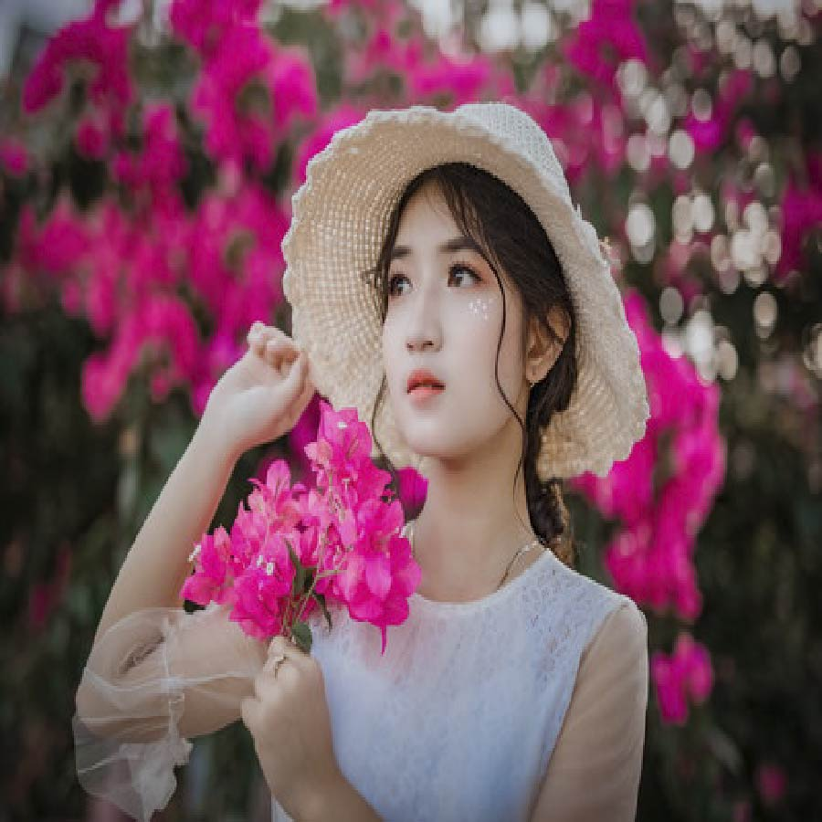

# Applying "Colorful Sketch Filter" on an image.

Converting an image into a colorful sketch filtered image using OpenCv, Os, Matplotlib and Numpy.

## Steps:
* Firstly imported the required libraries which are Numpy, Os, Matplotlib and Cv2.
* Taking path of the image/Real image as input using os and finally reading it using cv2

## Methods Used
* Used Bilateral Filter
* Followed by Median Blur
* Followed by Adaptive Threshold
* And at last used Bitwise or
* Finally converted the image into colorful sketch filter image

## Original Image

## Colorful Sketch Filtered Image

