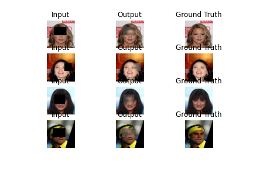
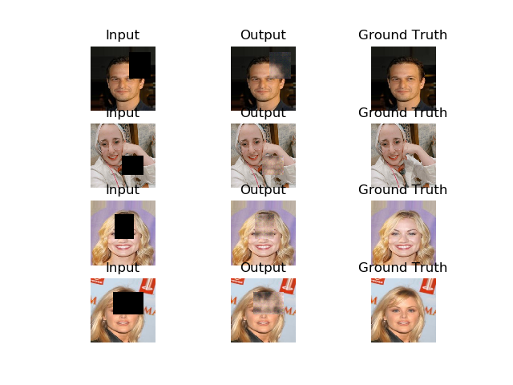

# Face-Completion-Using GANs
### Model: 
this model is implemented from this paper [Globally and Locally Consistent Image Completion](http://iizuka.cs.tsukuba.ac.jp/projects/completion/data/completion_sig2017.pdf)

 

### Dataset:
[Large-scale CelebFaces Attributes (CelebA)](http://mmlab.ie.cuhk.edu.hk/projects/CelebA.html) 

### Requirements:
* tensorflow 2.2.0

### Train :
* to train the model just run 
``` 
$ python train.py
```
* Note : I have trained the model using only **3000** samples of datasets and **200** Epochs  
 so the result looks not very good.
 
 ### Test 
 * To test the model put your photo on test folder. 
 * download completion model from [here](https://drive.google.com/drive/folders/1-ZyFnPw-lVDtdpqfuBQEVd1qeQR4bRox?usp=sharing). 
 * run the test script.
``` 
$ python test.py
```

### Results 
* After 100 Epoch 



* After 200 Epoch


* Test Results 


