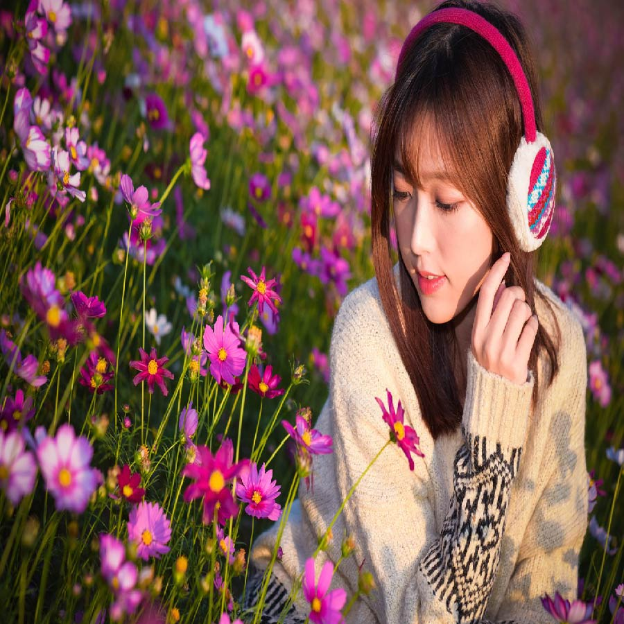

# Applying Glitter filter on an image.

Converting an image into glitter filter image using OpenCv, Matplotlib and Numpy.

## Steps:
* Firstly imported the required libraries which are Numpy, Matplotlib, Os and Cv2.
* Read the input image/Real image using cv2

## Methods Used
* Used Bilateral Filter
* Followed by Median Blur
* And at last used Bitwise or
* Finally converted the image into glitter filtered image

## Original Image

## Glitter Filtered Image

