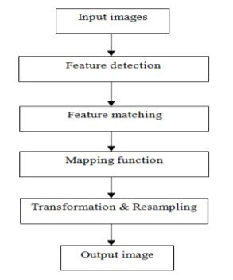
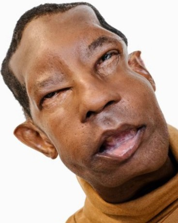
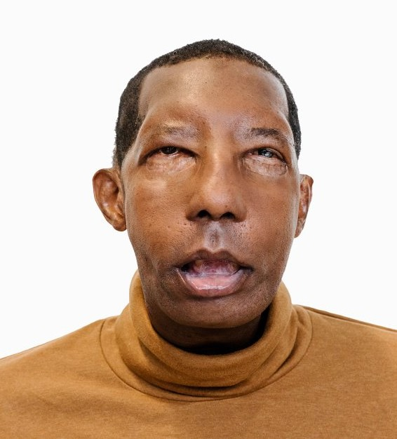
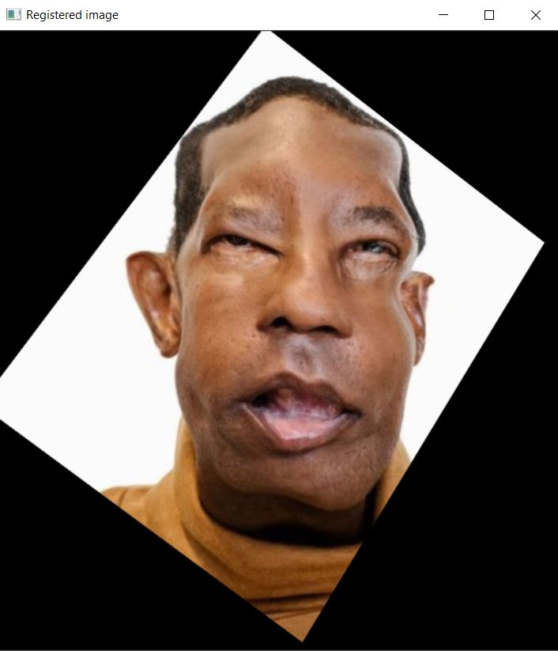

# Image Registration

Image registration is a method to accomplish mapping between two different images of same scene taken at different times on regular time interval, from different viewpoints of same scene,
and/or by different sensors to integrate the information. It’s a method to superimpose the pixels from reference image to the target image by aligning the images into common coordinate system. 

The possible application areas of registration such as in remote sensing (image mosaicking, landscape planning, fusion of information, registration of aerial and satellite data into maps), in medical (monitoring of tumor evaluation, magnetic resonance image MRI, ultrasound, magnetic resonance spectroscopy, specimen classification, positron emission tomography PET, single photon emission computed tomography SPECT), and in computer vision (shape recovery, automatic change detection, motion tracking, automatic quality inspection, target templatematching).

Aligning the images using different methods like Geometrical transformation, Point based method, surface based method and Intensity based method. It has been widely used in change detection, image fusion, clinical diagnosis and other related areas. Misalignment between the two images may be due to viewpoints, sensor position, viewing characteristics or from the object movement and deformation. 

### To realize image registration procedure the following steps has to be implemented as shown below:

 

 
 

* ## Feature Detection

   In this step the extraction of salient features/structures and distinctive objects from both reference and sensed images (like significant regions,edges, corners, points, or lines etc) are carried out.These features are represented by control points(CPs) which are centre of gravity, line endings,distinctive points, object contours, coastal lines,roads, line intersections, and road crossings which are invariant with respect to rotation, scaling, translation and skewing.

* ## Feature matching

   In this section the major focus is on the feature detected in reference and sensed images. This approach is mainly divided onto two methods area based and feature based. Area based approach deals with the matching approach as on the predefined size or even entire image rather than on the salient features. While in case of the feature based approach the control points are estimated for a perfect match between a reference and sensed image.The whole focus is on the spatial relations or various descriptors of features.

* ## Mapping function

   After the feature detection and feature matching approach the corresponding mapping function is designed. The reference and sensed images are matched together using the mapping function design with the corresponding control points. The control points mapping must be as possible as much to make a significant influence in the resulting registration.

* ## Transformation & Resampling

  The sensed image is transformed and reconstructed with the mapping function the images are registered. The transformation can be realized in a forward or backward manner. Forward manner in which using mapping function the pixels from the sensed image is directly transformed. While in case of backward approach the pixels from the target image is determined and the inverse mapping function is established.

## What's & Why's of the code?

>Libraries used : numpy & opencv

* __Import two images one a reference image & second a distorted image__

    Importing or reading of the images are done using [cv2.imread()](https://opencv-python-tutroals.readthedocs.io/en/latest/py_tutorials/py_gui/py_image_display/py_image_display.html)

* __Convert both the images two grayscale__
  
  We convert to grayscale because it is a one layer image from 0-255 whereas the RGB have three different layer image. This makes the calculations easy and simplified.

  This is done using [cv2.cvtColor()](https://opencv-python-tutroals.readthedocs.io/en/latest/py_tutorials/py_imgproc/py_colorspaces/py_colorspaces.html)

* __Initiate the ORB detector__
    
    ORB is basically a fusion of FAST keypoint detector and BRIEF descriptor with many modifications to enhance the performance. First it use FAST to find keypoints, then apply Harris corner measure to find top N points among them. It also use pyramid to produce multiscale-features.
    
    It is a good alternative to SIFT and SURF in computation cost, matching performance and mainly the patents.

    ORB’s main contributions are as follows:

    * The addition of a fast and accurate orientation component to FAST.

    * The efficient computation of oriented BRIEF features.

    * Analysis of variance and correlation of oriented BRIEF features.

    * A learning method for decorrelating BRIEF features under rotational invariance, leading to better performance in nearest-neighbor applications.

    This initiation of ORB is done using [cv2.ORB_create()](https://opencv-python-tutroals.readthedocs.io/en/latest/py_tutorials/py_feature2d/py_orb/py_orb.html)

* __Find keypoints and describe them__

    This is done using the [orb.detectAndCompute()](https://docs.opencv.org/3.4/d0/d13/classcv_1_1Feature2D.html) which detects the _keypoints_ and _descriptors_ from both the images(refernce & distorted) and [cv2.drawKeypoints()](https://docs.opencv.org/3.4/d4/d5d/group__features2d__draw.html) which draws the keypoints on the images.

    Keypoints from both the images are matched using [cv2.drawMatches()](https://www.kite.com/python/docs/cv2.drawMatches). 
    
    This is done to showcase and display the matched keypoints from both the images.

* __Match keypoints-Brute Force Matcher__

    Brute-Force matcher is simple. It takes the descriptor of one feature in first set and is matched with all other features in second set using some distance calculation. And the closest one is returned.

    This is done using [cv2.DescriptorMatcher_create(cv2.DESCRIPTOR_MATCHER_BRUTEFORCE_HAMMING)](https://opencv-python-tutroals.readthedocs.io/en/latest/py_tutorials/py_feature2d/py_matcher/py_matcher.html)

    The above is used to create an object of matched points which is later used in homography process.

* __Filtering the keypoints__

    This filtering of keypoints is done using _RANSAC_ .
    Random sample consensus, or RANSAC, is an iterative method for estimating a mathematical model from a data set that contains outliers. The RANSAC algorithm works by identifying the outliers in a data set and estimating the desired model using data that does not contain outliers.

* __Register the two images using homography__

    [Homography](https://mattmaulion.medium.com/homography-transform-image-processing-eddbcb8e4ff7#:~:text=Homography%2C%20also%20referred%20to%20as,in%20a%20homogenous%20coordinates%20space.) , also referred to as planar homography, is a transformation that is occurring between two planes. In other words, it is a mapping between two planar projections of an image. It is represented by a 3x3 transformation matrix in a homogenous coordinates space.

    Mathematically, the homograohy matrix is represented as:

    

     
     

    

    As observed in the illustration, the element in an image has its projection to the other image in a homogenous coordinate plane, retaining the same information but in a transformed perspective.

    Here, in my code I have collected the relevant keypoints, and stored them  in list named _points1_, _points2_ from the respective images. I used these for train and test purpose to find the _homography matrix(h)_ and the _mask_.
    This I have done using [cv2.findHomography()](https://docs.opencv.org/master/d9/d0c/group__calib3d.html#ga4b3841447530523e5272ec05c5d1e411).

    After that I have registered the _distorted image_ using the _homography matrix(h)_ and the _reference image_ dimensions with the help of [cv2.warpPerspective()](https://docs.opencv.org/master/da/d54/group__imgproc__transform.html#gaf73673a7e8e18ec6963e3774e6a94b87).

After following all the above steps we get the registered image.

# Distorted Image

 
 

# Reference Image

 
 

# Registered Image

    

