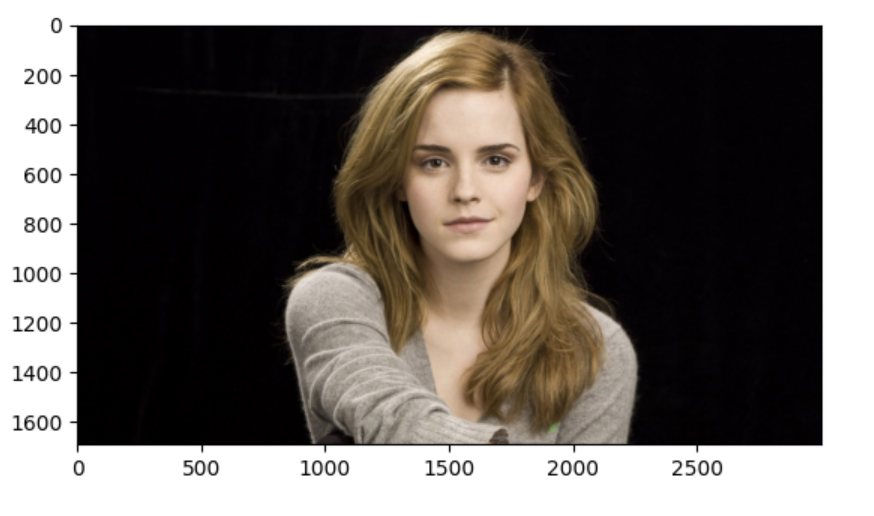
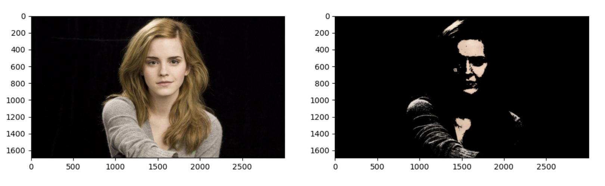

<h1> Image Segmentation Using Color space and Opencv</h1>
<h2>Introduction</h2>

The process of partitioning a digital image into multiple segments is defined as image segmentation. Segmentation aims to divide an image into regions that can be more representative and easier to analyze. Such regions may correspond to individual surfaces, objects, or natural parts of objects. Typically image segmentation is the process used to locate objects and boundaries (e.g., lines or curves) in images . Furthermore, it can be defined as the process of labeling every pixel in an image, where all pixels having the same label share certain visual characteristics 

<h2>What are color spaces?</h2>

Basically, Color spaces represent color through discrete structures (a fixed number of whole number integer values), which is acceptable since the human eye and perception are also limited. Color spaces are fully able to represent all the colors that humans are able to distinguish between.
RGB is one of the five major color space models, each of which has many offshoots. There are so many color spaces because different color spaces are useful for different purposes.
HSV and HSL are descriptions of hue, saturation, and brightness/luminance, which are particularly useful for identifying contrast in images.
 
 <h2>Steps followed for implementation</h2>
 <ul type="one">
 <li>Converted the image into HSV</li>
<li>Choosing swatches of desired color , In this, shades of light and dark orange has been taken.</li>
<li> Applying orange shade mask on to the image</li>
<li>Adding the second swatches of color, Here shades of white was chosen i.e light and dark shades</li>
<li>Apply the whte mask onto the image</li>
<li>Now combine the two masks ,Adding the two masks together results in 1 values wherever there is orange shade or white shade.</li>
 <li>Clean up the segmentation using a blur </li>
 </ul>

 
 

 <h2>Default  image in BGR color space</h2>
 
 
 <h2>Image converted to RGB color space</h2>
 
 
 <h2>Image converted to GRAY color space</h2>
 
 
 <h2>Image converted to HSV color space</h2>
 
 

 
 

 <h2>Segmented images</h2>
 
 
 

 
 <h2>Instructions to Run</h2>
 <ul>
 <li>Colne this repo https://github.com/akshitagupta15june/Face-X.git</li>
 <li>Change Directory cd Awesome-face-operations</li>
 <li>Then go to cd image_segmentation</li>
 <li>Run code file. python image_segmentation1.py</li>
 </ul>
 
 
  
 

 
 

 

