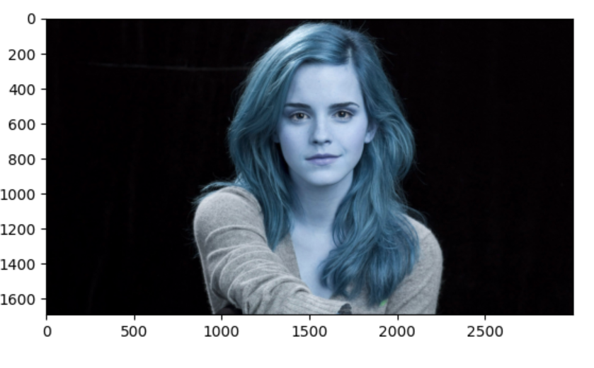

<h1> Image Segmentation Using Color space and Opencv</h1>
<h2>Introduction</h2>

The process of partitioning a digital image into multiple segments is defined as image segmentation. Segmentation aims to divide an image into regions that can be more representative and easier to analyze. Such regions may correspond to individual surfaces, objects, or natural parts of objects. Typically image segmentation is the process used to locate objects and boundaries (e.g., lines or curves) in images . Furthermore, it can be defined as the process of labeling every pixel in an image, where all pixels having the same label share certain visual characteristics 

<h2>What are color spaces?</h2>

Basically, Color spaces represent color through discrete structures (a fixed number of whole number integer values), which is acceptable since the human eye and perception are also limited. Color spaces are fully able to represent all the colors that humans are able to distinguish between.
RGB is one of the five major color space models, each of which has many offshoots. There are so many color spaces because different color spaces are useful for different purposes.
HSV and HSL are descriptions of hue, saturation, and brightness/luminance, which are particularly useful for identifying contrast in images.
 
 
 <h2>Default  image in BGR color space</h2>
 
 
 <h2>Image converted to RGB color soace</h2>
 
 
 <h2>Image converted to GRAY color soace</h2>
 
 
 <h2>Image converted to HSV color soace</h2>
 
 
 

 

