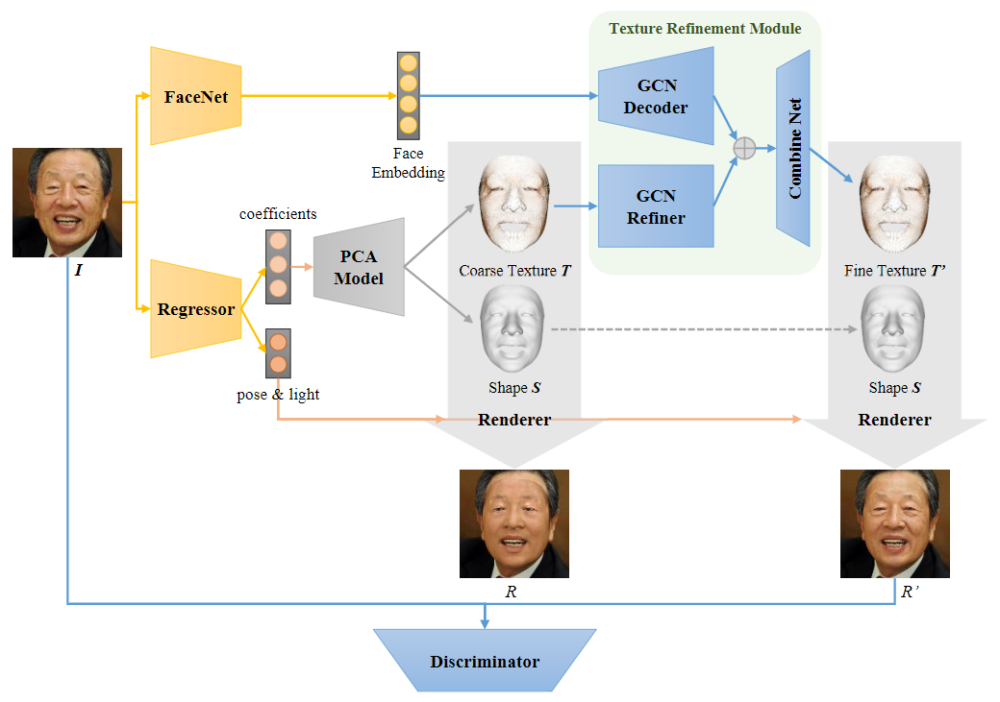
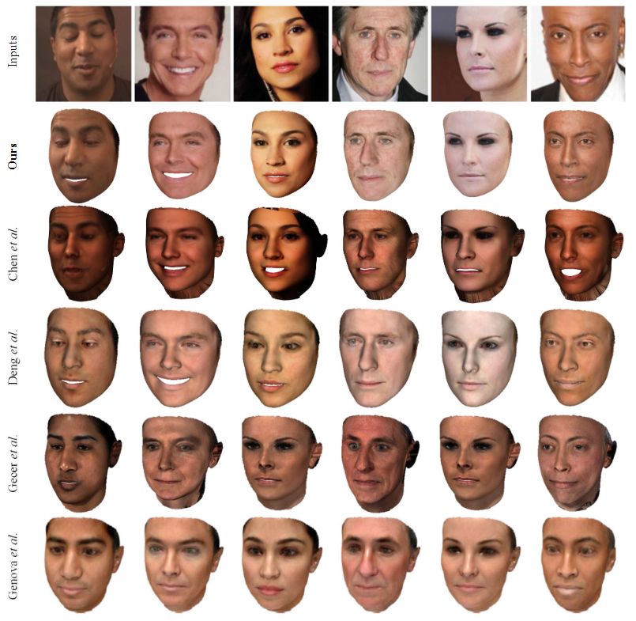

# 3D Face Reconstuction using Graph Convolutional Networks

Research paper : https://arxiv.org/abs/2003.05653

In this paper, they seek to reconstruct the 3D facial shape with high fidelity texture from a single image, without the need to capture a large-scale face texture database.

**An overview of the method.**  

Source : Internet

#### 1. Package Requirements
> tensorflow  
> tqdm  
> scikit-learn  
> scipy  
> mesh-renderer

#### 2. References

- The shapes and coarse textures : https://github.com/microsoft/Deep3DFaceReconstruction
- GCNs code : https://github.com/anuragranj/coma
- mesh processing libraries : https://github.com/MPI-IS/mesh

#### 3. Preparing dataset
As its mentioned in the paper, they use a face segmentation network to segment out the non-face areas. Here, they treat the segmentation result as alpha channel and store it in a `.png` file along with the face image. More specifically, we acquire the face segmentation result by a face segmentation network, then store the image and segmentation results as a `.png` file, where the RGB channels store the image, and alpha channel stores the segmentation results. In the alpha channel, 0 means `non-skin region` and 255 represents `skin region`.  
For efficiency, we then write all `.png` images into a binary file in advance. Please change the data folder in `create_bin.py` to yours.
> python create_bin.py

#### 4. Training
It is worth mentioning that, our network involves the mesh sampling algorithm. We save the sampling-related parameters into `.npz` files in advance and load them before training to avoid meaningless repeat calculation.  
More details could be found in utils.py#L266 init_sampling().

After the dataset files are ready, the training can be started.
> python main.py --mode train

#### 5. Output
The following gives the comparison for various face constraints retrieved using this model and using the ones mentioned in the paper: 

#### Citation
    @inproceedings{lin2020towards,  
      title={Towards high-fidelity 3D face reconstruction from in-the-wild images using graph convolutional networks},  
      author={Lin, Jiangke and Yuan, Yi and Shao, Tianjia and Zhou, Kun},  
      booktitle={Proceedings of the IEEE/CVF Conference on Computer Vision and Pattern Recognition},  
      pages={5891--5900},  
      year={2020}  
    }
