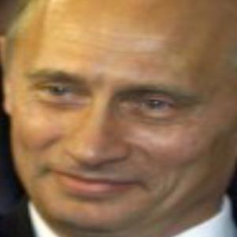
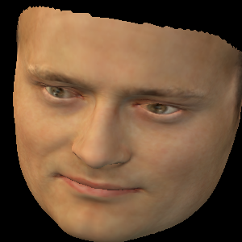

# Accurate 3D Face Reconstruction with Weakly-Supervised Learning: From Single Image to Image Set

Pytorch version of the repo [Deep3DFaceReconstruction](https://github.com/microsoft/Deep3DFaceReconstruction).

This repo only contains the **reconstruction** part, so you can use [Deep3DFaceReconstruction-pytorch](https://github.com/changhongjian/Deep3DFaceReconstruction-pytorch) repo to train the network. And the pretrained model is also from this [repo](https://github.com/changhongjian/Deep3DFaceReconstruction-pytorch/tree/master/network).

## Features

### MTCNN

I use mtcnn to crop raw images and detect 5 landmarks. The most code of MTCNN comes from [FaceNet-pytorch](https://github.com/timesler/facenet-pytorch).

### Pytorc3d

In this repo, I use [PyTorch3d 0.3.0](https://github.com/facebookresearch/pytorch3d) to render the reconstructed images.

### Estimating Intrinsic Parameters

In the origin repo ([Deep3DFaceReconstruction-pytorch](https://github.com/changhongjian/Deep3DFaceReconstruction-pytorch)), the rendered images is not the same as the input image because of `preprocess`. So, I add the `estimate_intrinsic` to get intrinsic parameters.

## Examples:

Here are some examples:

|Origin Images|Cropped Images|Rendered Images|
|-------------|---|---|
||||


## File Architecture

```
├─BFM               same as Deep3DFaceReconstruction
├─dataset           storing the corpped images
│  └─Vladimir_Putin
├─examples          show examples
├─facebank          storing the raw/origin images
│  └─Vladimir_Putin
├─models            storing the pretrained models
├─output            storing the output images(.mat, .png)
│  └─Vladimir_Putin
└─preprocess        cropping images and detecting landmarks
    ├─data          storing the models of mtcnn
    ├─utils
```

Also, this repo can also generate the UV map, and you need download UV coordinates from the following link:  
&nbsp;&nbsp;Download UV coordinates fom STN website: https://github.com/anilbas/3DMMasSTN/blob/master/util/BFM_UV.mat  
&nbsp;&nbsp;Copy BFM_UV.mat to BFM

