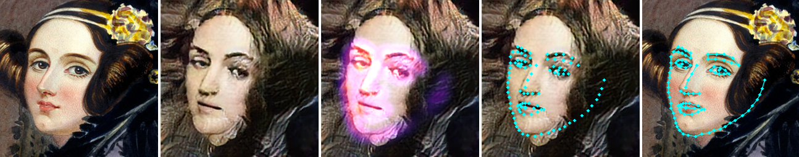
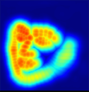
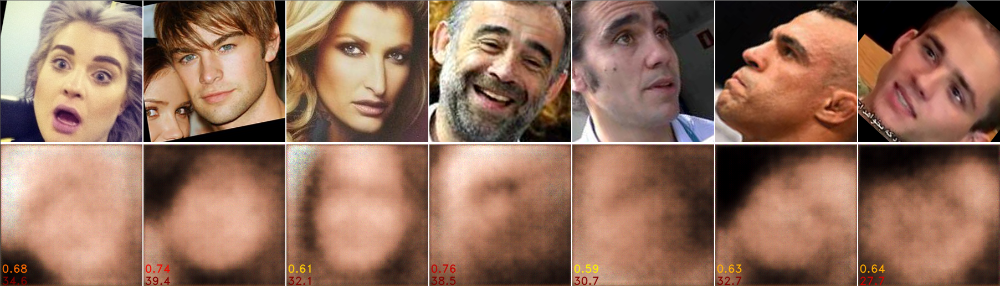
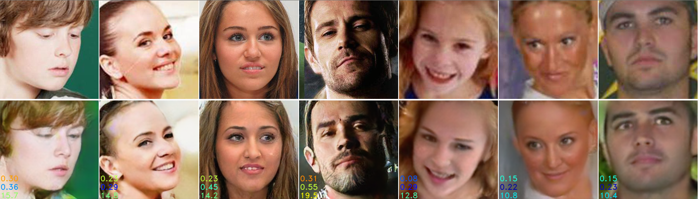
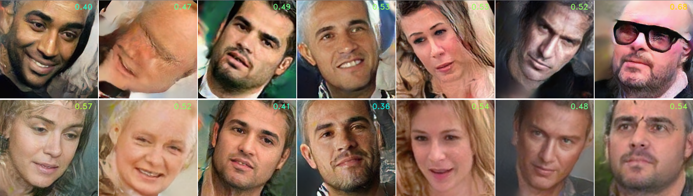
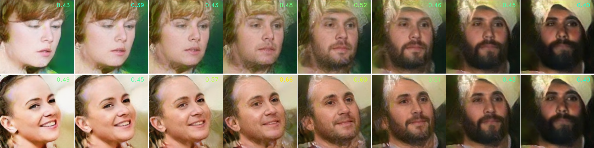
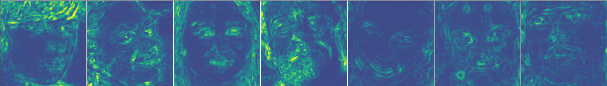
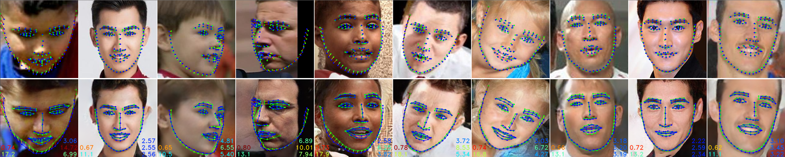
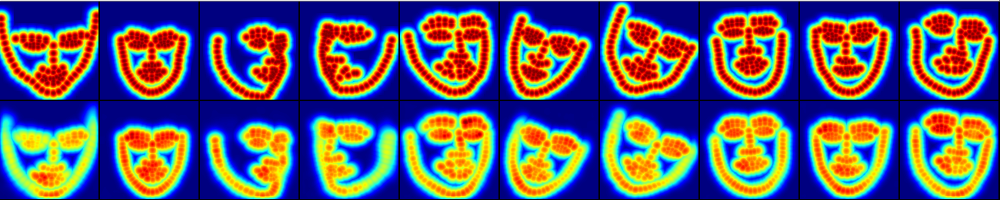

# 3FabRec
This is the PyTorch implementation of the paper [**3FabRec: Fast Few-shot Face alignment by Reconstruction**](https://arxiv.org/abs/1911.10448) (CVPR 2020) by Björn Browatzki and Christian Wallraven.

3FabRec predicts 2D facial landmarks from a few annotated training images by leveraging implicit knowledge extracted from a generative model trained on unlabeled face images.

 

## Requirements

- Python 3.6 or newer
- PyTorch >= 1.1.0
- CUDA >= 10.0
- cuDNN >= 7.5

## Getting started

Download or clone the full repository.


### Install dependencies
```
pip install -r requirements.txt
```

### Download models

```
./download_models.sh
```

### Run demo

```
python demo.py
```

The output should look like this:



Tiles: Input, reconstruction, heatmap overlay, pred. in recon., pred. in input.



Predicted landmark heatmaps (channels collapsed)


## Preparing datasets

To train your own models or run evaluations, you will need to download some of the following face datasets:

For unsupervised face learning
- VGGFace2
- AffectNet

For landmark training or evaluation
- 300-W
- AFLW
- WFLW

Download the original datasets. Then update locations in local_config.ini.

```
DATASET = /my_big_slow_hdd/dataset 
DATASET_local = /my_small_fast_ssd/dataset (optional cache dir)
```
For each dataset there is the option of specifying a separate cache directory (XXX_local). This usefull in case the data is located on a slow/remote volume, there is no write access, or you just prefer to separate the original data from intermediate files created during processing.

Image crops and metadata are created automatically when loading original images and saved to the cache directory.


## Training

### Autoencoder training

To train a basic model on VGGFace2 and AffectNet with image size of 256x256 and standard data augmentations, run:

```
python train_aae_unsupervised.py --sessionname my_model --daug 4 --dataset-train vggface2 affectnet --input-size 256 --epoch 1 
``` 

```
Setting up dataset VggFace2...
Removing faces with height <= 100.00px...
Number of images: 1854163
Number of identities: 8631
Setting up dataset AffectNet...
Dataset VggFace2
    Number of datapoints: 1854163
    Root location: /media/browatbn/073dbe00-d671-49dd-9ebc-c794352523ba/datasets/VGGFace2
    StandardTransform
Transform: Compose(
               RandomHorizontalFlip(p=0.5)
               RandomAffine(degrees=(-45, 45), translate=[0.035, 0.035], scale=[0.94, 1.03], shear=(-5, 5))
           )
Dataset AffectNet
    Number of datapoints: 287651
    Root location: /home/browatbn/dev/datasets/AffectNet
        Class sizes:
          74874  (26.03%)	(Neutral)
          134415 (46.73%)	(Happy)
          25459  (8.85%)	(Sad)
          14090  (4.90%)	(Surprise)
          6378   (2.22%)	(Fear)
          3803   (1.32%)	(Disgust)
          24882  (8.65%)	(Anger)
          3750   (1.30%)	(Contempt)
        --------------------------------
          287651
    StandardTransform
Transform: Compose(
               RandomHorizontalFlip(p=0.5)
               RandomAffine(degrees=(-45, 45), translate=[0.035, 0.035], scale=[0.94, 1.03], shear=(-5, 5))
           )
Setting up dataset VggFace2...
Removing faces with height <= 100.00px...
Number of images: 175
Number of identities: 1
Dataset VggFace2
    Number of datapoints: 175
    Root location: /media/browatbn/073dbe00-d671-49dd-9ebc-c794352523ba/datasets/VGGFace2
    StandardTransform
Transform: Compose(
           )
Trainable params Q: 11,379,491
Trainable params P: 10,868,096
Trainable params D_z: 1,102,001
Trainable params D: 1,743,744
Learning rate: 2e-05
[2020-05-20 15:00:48] 
[2020-05-20 15:00:48] Starting training session 'my_model'...
[2020-05-20 15:00:48] 
[2020-05-20 15:00:48] 
[2020-05-20 15:00:48] ===== Epoch 1/1
[2020-05-20 15:01:04] [1][(50/42836] l=80.490  l_rec=80.490 l_ssim=-1.000(0.19) l_lmrec=-1.000 l_lmssim=-1.00 z_mu= 0.019 l_D_z=1.323 l_E=0.727 l_D=-1.000(-1.000/-1.000) l_G=-1.000(-1.000/-1.000) 0.08/0.24/0.32s (000050 0:00:16)
[2020-05-20 15:01:16] [1][(100/42836] l=63.883  l_rec=63.883 l_ssim=-1.000(0.23) l_lmrec=-1.000 l_lmssim=-1.00 z_mu= 0.026 l_D_z=1.189 l_E=0.733 l_D=-1.000(-1.000/-1.000) l_G=-1.000(-1.000/-1.000) 0.03/0.21/0.24s (000100 0:00:28)
[2020-05-20 15:01:28] [1][(150/42836] l=61.454  l_rec=61.454 l_ssim=-1.000(0.31) l_lmrec=-1.000 l_lmssim=-1.00 z_mu= 0.027 l_D_z=1.078 l_E=0.757 l_D=-1.000(-1.000/-1.000) l_G=-1.000(-1.000/-1.000) 0.02/0.21/0.24s (000150 0:00:39)
``` 


This runs training for one epoch using only a pixelwise reconstruction loss. After a few minutes, faces should start emerging.


  

The two numbers in the bottom left corner represent [SSIM](https://en.wikipedia.org/wiki/Structural_similarity) error (0-1, top) and average pixel error (0-255, bottom).
Eventually the reconstructions become more accurate but remain blurry.

Next, add a GAN to make images more realistic. Train for one more epoch:

```
python train_aae_unsupervised.py -r my_model/00001 --with-gan 1 --daug 4 --epoch 2
``` 

Finally, we can add the structural image loss to better align facial structures in reconstructions and suppress GAN artefacts:

```
python train_aae_unsupervised.py -r my_model/00002 --with-gan 1 --with-ssim-loss 1 --daug 4 --epoch 3
``` 
We have now trained for a total of 3 epochs (3 x 2.1Mio images). Images should start to look ok now but will keep improving when training longer. Aim for 50-100 epochs for optimal results. It will take a few days... :)  

#### Outputs during training

**Snapshots** and **visualizations** are saved after every epoch to the location specified in local_config.ini.
```
data = /media/browatbn/073dbe00-d671-49dd-9ebc-c794352523ba/dev/data    (for snapshots)
outputs = ./outputs   (for visualizations)
``` 

If show is True (default), visualizations will also shown on screen:

- **Reconstructions**



- **Randomly generated images**



- **Interpolations between pairs of reconstructions**



- **Error maps of structural loss** (if with-ssim-loss)



### Training landmark detection (full data)

To train, for example, the previous autoencoder model on landmarks from the 300-W dataset:

```
python train_aae_landmarks.py --sessionname lms_300w -r my_model/00003 --dataset w300
```

**Finetune encoder `--train-encoder 1`:**

```
python train_aae_landmarks.py --sessionname lms_300w -r my_model/00003 --dataset w300  --train-encoder 1
```

### Training landmark detection (few shot)

Train using 50 images from 300-W:

```
python train_aae_landmarks.py --sessionname lms_300w_50 -r my_model/00003 --dataset w300 --train-count 50 --print-freq 1
```

Please note: For very low image counts (<50), encoder finetuning only leads to small performance gains and might even result in overfitting (worse performace).


## Evaluation

### Visualize results

To visualize some detections on WFLW for example:

```
python eval_aae_landmarks.py -r lms_wflw --dataset wflw
```
```
...
[2020-05-20 17:26:04] Resuming session lms_wflw from snapshot lms_wflw/00150...
[2020-05-20 17:26:04] Model lms_wflw/00150 trained for 2589834 iterations (7 days, 8:43:24).
[2020-05-20 17:26:04] 
[2020-05-20 17:26:04] Evaluating 'lms_wflw'...
[2020-05-20 17:26:04] 
[2020-05-20 17:26:05] [151][(1/20] l_rec=14.215 l_lms=0.2655 err_lms=3.52/6.46/4.51 0.14/0.42/0.56s (2589835 0:00:00)
...
```

This loops through the test set and visualizes results split into small batches of 10 images.



Figure 1 shows input images in the top row and their reconstructions below. Grouth truth landmarks are shown in green and predited landmarks in blue.
Bottom left corners show SSIM error and reconstruction error (see [above](#autoencoder-training)).
The 3 values in the bottom right are normalized mean errors for inner/outer/all landmarks.


The second figure shows ground truth heatmaps and predicted heatmaps for the same faces as Figure 1.




### Benchmark performance

To evaluate performance on the entire test set, switch to benchmark mode: `--benchmark`. To run on a specific subset use param `--test-split SPLITNAME`.

```
python eval_landmarks.py -r lms_wflw --dataset wflw --test-split make-up --benchmark
```


## Citation

If you find this project usefull, please cite the following paper:
```
@inproceedings{browatzki2020,
  title={3FabRec: Fast Few-shot Face alignment by Reconstruction},
  author={Browatzki, Bjoern and Wallraven, Christian},
  booktitle={CVPR},
  year={2020}
}
```
