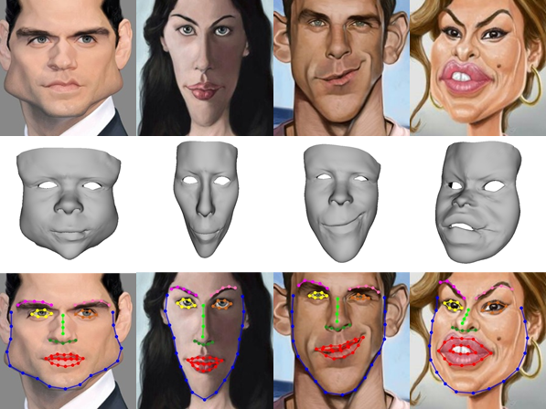
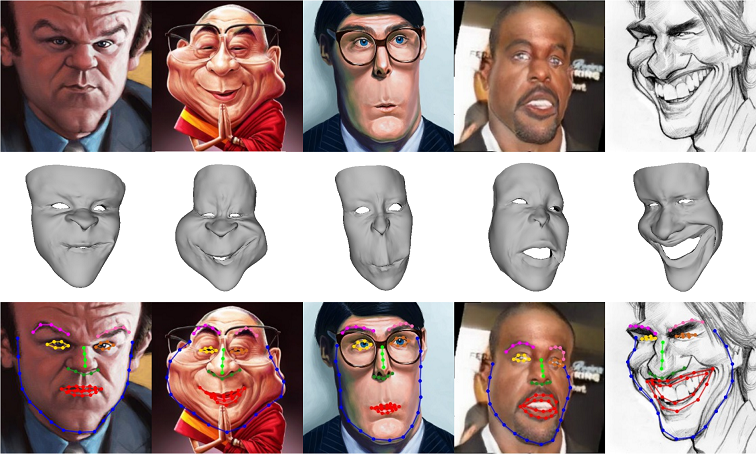

# CaricatureFace
This repository includes source code, pretrained model and a 3D dataset of paper "Landmark Detection and 3D Face Reconstruction for Caricature using a Nonlinear Parametric Model", [http://arxiv.org/abs/2004.09190](http://arxiv.org/abs/2004.09190).

Authors: [Juyong Zhang](http://staff.ustc.edu.cn/~juyong/), Hongrui Cai, Yudong Guo and Zhuang Peng.

Note that all of the code is protected under patent. It can be only used for research purposes. If you are interested in business purposes/for-profit use, please contact Juyong Zhang (the corresponding author, email: juyong@ustc.edu.cn).



## Update Logs:
### January 3, 2021
* Make the entire 3D caricature dataset public! And attach the scripts for visualization!
### December 5, 2020
* Update the examples and add a figure for exhibition.
### August 26, 2020
* Add a method for computing the dynamical contour indices.
### July 20, 2020
* Add a method for calculating errors.
### May 9, 2020
* Add a toy example for conversion between 3D face and vertices.
### April 22, 2020
* The testset is enlarged.
### April 8, 2020
* The source code, pretrained model and some data from testset are released.

## 3D Caricature Dataset
You can download the 3D caricature dataset we constructed via [Google Drive](https://drive.google.com/file/d/1M9NVRWpd_L_Cz2yrgEggkpQJ1YV_wBh6/view?usp=sharing), or [Baidu Drive](https://pan.baidu.com/s/14XAd7c5W-sCxnQr5QyMKZw) with password: 0nk6. The 3D caricature dataset contains 7,800 2D caricatures, 2D landmarks and 3D meshes. We also attach the scipts for visualization.

## Comparison with us
If you want to do some comparison with our method, you can download a testset here [Google Drive](https://drive.google.com/open?id=1fGHlV8ISUkgCK8OSTQxvEJxtxXXrwjDI), or [Baidu Drive](https://pan.baidu.com/s/1YhniT8yb6C5yvO9gq_YYoA) with password: 4nvs. It includes 2D caricatures, groundtruth 68 landmarks, 68 landmarks detected by our method and 3D meshes recovered by our method.

## Prerequisites and Installation
- Python 3.7
- Pytorch 1.4.0
- opencv-python 3.4.2

### Getting Started
**Clone this repository:**
```bash
git clone git@github.com:Juyong/CaricatureFace.git
cd CaricatureFace
```
**Install dependencies using Anaconda:**
 ```bash
conda create -n cariface python=3.7
source activate cariface
pip install -r requirements.txt
```

## Advanced Work
**Prepare related data:**
- You can download related data for alogorithm here [Google Drive](https://drive.google.com/open?id=11m9dC6j-SUyjhtSiXsUqiBdZOQ3S8phD), or [Baidu Drive](https://pan.baidu.com/s/1v4V-7rYszDhyhzhCH2aYeA) with password: tjps.
- Unzip downloaded files and move files into ```./data``` directory.

**Prepare pretrained model:**
- You can download pretrained model here [Google Drive](https://drive.google.com/open?id=1If_rjQp5mDZMbK1-STGYOPyw_cTG66jO), or [Baidu Drive](https://pan.baidu.com/s/113QFM-zhSUIZfzjFhQfTTA) with password: fukf.
- Unzip downloaded files and move files into ```./model``` directory.

**Prepare some examples:**
- You can download some examples here [Google Drive](https://drive.google.com/open?id=1X8TpVpGzRrQuSS93_Hb32ERU-P4q6SSG), or [Baidu Drive](https://pan.baidu.com/s/1fn6Ll3ogF5LrYByBe-T5Ew) with password: sq06.
- Unzip downloaded files and move files into ```./exp``` directory.

## Test with Pretrained Model
Within ```./CaricatureFace``` directory, run following command:
 ```bash
    bash test.sh
```

Note: Input images must be preprocessed - crop the whole face roughly and resize to size (224, 224).

## Recover 3D faces
Please follow README.txt in ```./toy_example``` directory.

## Compute the dynamical contour indices
Please follow README.txt in ```./update_contour``` directory.

## Gallery


## Citation
If you find this useful for your research, please cite the paper:
```
@article{Zhang2020Caricature,
  author    = {Juyong Zhang and
               Hongrui Cai and
               Yudong Guo and
               Zhuang Peng},
  title     = {Landmark Detection and 3D Face Reconstruction for Caricature using a Nonlinear Parametric Model},
  journal   = {CoRR},
  volume    = {abs/2004.09190},
  year      = {2020}
}
``` 
