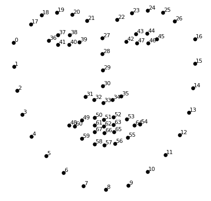

# FACE FEATURE DETECTION USING DLIB 

Using the dlib library, we obtain and highlight the cordinates of the facial features:

1) Jaw
2) Right Eyebrow
3) Left Eyebrow
4) Nose
5) Right Eye
6) Left Eye
7) Mouth

# WORKING

Here, a pre-trained facial landmark detector inside the dlib library is used to estimate the location of 68 (x, y)-coordinates that map to facial structures on the face. The 68  landmark output is shown in the figure below.



After obtaiing each feature using the indexes, we highlight them using colours after computing the convex hull and contours.

# USAGE

To run the program, simply type the following command :

```
pip install requirements.txt
```
```
python detect_face_features.py --image image_path/image_file_name
```

# SAMPLE INPUT


# SAMPLE OUTPUT


