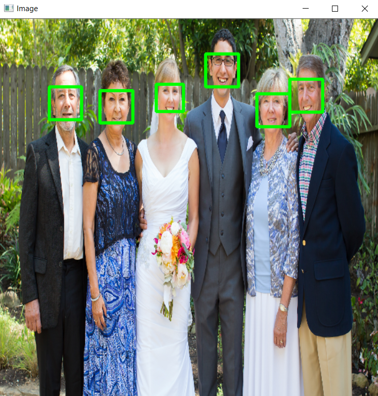

## FACE DETECTION USING DLIB HOG
Dlib is a toolkit for making real world machine learning and data analysis applications in C++. It is widely used for image processing, computer vision etc. Though it is originally written in C++ it can be easily used in python.
HOG is short for Histogram of oriented gradients. The detector is based on HOG and Linear SVM.
HOG is a simple and powerful feature descriptor. It is not only used for face detection but also it is widely used for object detection like cars, pets, and fruits. HOG is robust for object detection because object shape is characterized using the local intensity gradient distribution and edge direction.


### Step1: The basic idea of HOG is dividing the image into small connected cells

### Step2: Computes histogram for each cell. 

### Step3: Bring all histograms together to form feature vector i.e., it forms one histogram from all small histograms which is unique for each face

Make sure to install necessary libraries 
```
    pip3 install opencv-python
```
```
    pip install dlib
```

### Run the program
```
    python face_det.py
```

## The input image is :


## The output


