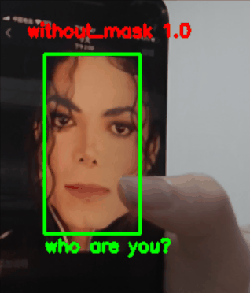

# Masked Face Recognition

## Introduce

- mask_detection_only is only for mask detection
- facenet can recognize faces (with masks)

## Environment

- run ```pip -r requirements.txt``` or ```conda env create -f environment.yaml```
- I used tensorflow 1.15 for facenet, tensorflow 2.4.0 for training resnet mask detection.

## How to run

1. Download [20180408-102900](https://drive.google.com/open?id=1R77HmFADxe87GmoLwzfgMu_HY0IhcyBz) model from [FaceNet GitHub page](https://github.com/davidsandberg/facenet)
2. Put the model at facenet/models
3. Train your face data
    1. Align your images
    ```
    python alignment.py [original_data_path] [aligned_data_path]
    ```
    * For example:
    ```
    python alignment.py people people_aligned
    ```
    2. Train your data
    ```
    python src/classifier.py TRAIN ./people_aligned ./models/20180408-102900 ./models/mypkl.pkl
    ```
    * "mypkl.pkl" is your own model
    3. Replace the model path at contributed/face_mask.py
4. Run facenet camera recognition
```
python facenet/contributed/real_time_face_recognition.py
```

## Examples
