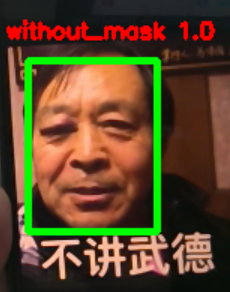

# Mask detection only

## How to use

1. Train: "mask_resnet_train.ipynb"
2. Predict: "camera_res_model.py"

## Dataset

download the dataset from [here](https://www.kaggle.com/omkargurav/face-mask-dataset)

The structure should be

```
├── mask_detection_only
│   ├── face_detector
│   │   ├── deploy.prototxt
│   │   ├── res10_300x300_ssd_iter_140000.caffemodel
│   ├── resnet_model
│   │   ├── saved_model.pb
│   │   ├── variables
│   │   │   ├── variables.data-00000-of-00002
│   │   │   ├── variables.data-00001-of-00002
│   │   │   ├── variables.index
│   ├── camera_res_model.py
│   ├── mask_resnet_train.ipynb
│   ├── data
│   │   ├── with_mask
│   │   ├── without_mask
```

## Example


