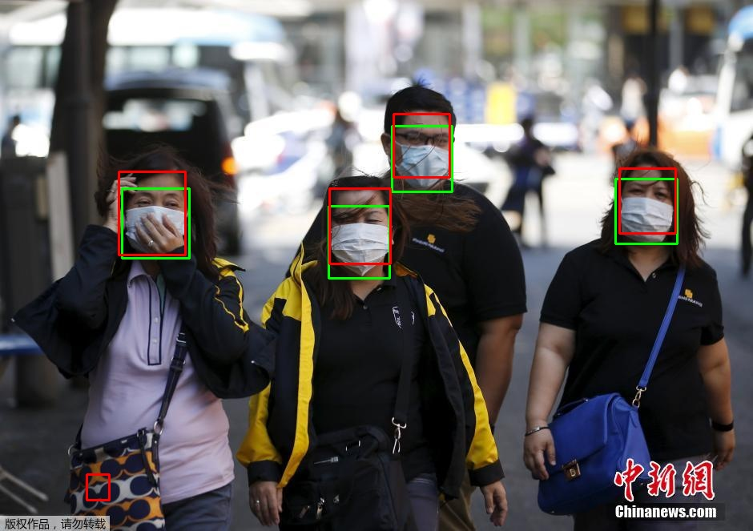
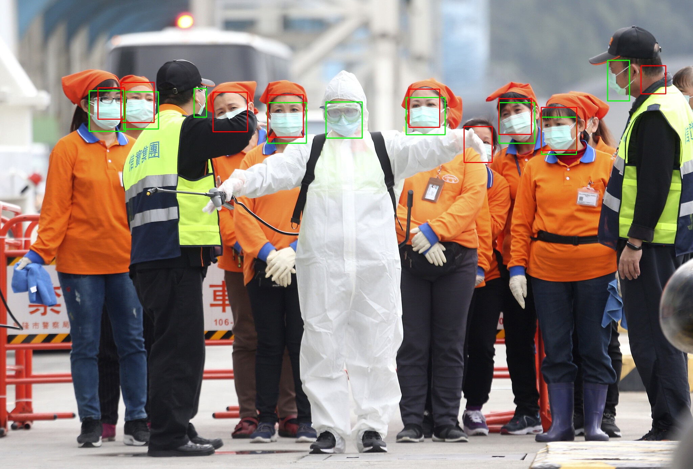

There is a recent surge for wearing masks in public spaces due to the COVID-19 pandemic, which has affected how we go through our everyday lives. Many public services require people to wear masks so as to avoid spreading the virus even more. This is a challenge for face detection mechanisms since the face can be occluded up to the nose, which yields lower confidence intervals for such models. While researchers are trying build new detection models or even retraining them with more difficult examples, I wanted to evaluate how current models perform under these harder scenarios.

The Multi-task Cascaded Convolutional Networks (MTCNN) designed by Zhang et al. is a three-stage detection model that produces both bounding boxes and facial landmarks. Compared to Viola and Jones face detector, MTCNN has greater recall and precision. I'll make sure to test their detector on the face mask dataset as well, but I think it is safe to say its results will be lower.

<p align="center"></p>

## Face tracker
I also added a face ID tracker which you can use to empirically check out how the MTCNN performs under variable situations where conditions change, such as illumniation and occlusion. The tracker is essentially the same as [PyImageSearch's centroid tracker](https://www.pyimagesearch.com/2018/07/23/simple-object-tracking-with-opencv/), I only did some minor changes.

## Implementation
Unless you want to verify the results, you're going to find yourself using only *main.py* which has the ID tracker already integrated.
```console
foo@bar:MtcnnMaskDetection$ python main.py camera_id
```
Finally, if you do want to run the test as well, cd to the *test* directory and run
```console
foo@bar:MtcnnMaskDetection$ python run_tests.py path/to/labels
```

## Dataset and test
The test images were taken from Kaggle's [Medical Mask Dataset](https://www.kaggle.com/vtech6/medical-masks-dataset), which contains 3000 faces wearing masks and ~700 faces with badly worn masks (or even none at all). The test results didn't take into account people with no masks whatsoever. To the best of my knowledge, **recall is the only available metric** since the groundtruth labels ignore some unmasked faces, which MTCNN may not, so it may seem it has a higher false positive rate.

## Results
Groundtruth bounding boxes are given in green while predictions are given in red.



<p align="center"></p
