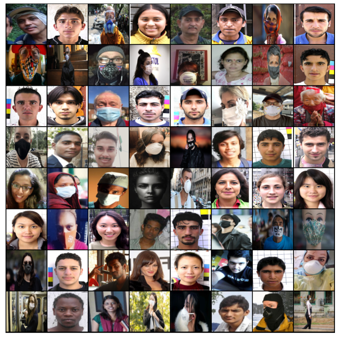
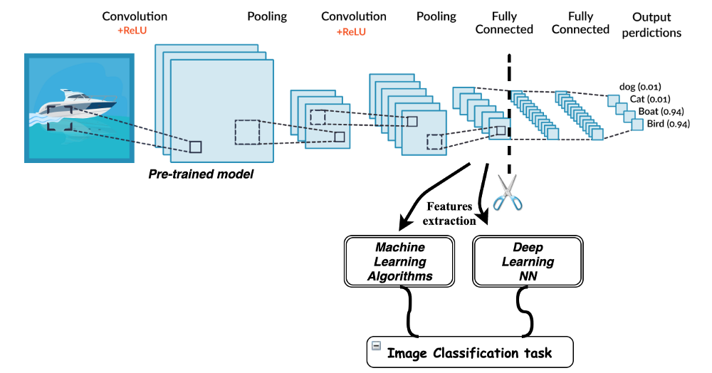

### Introduction:
- Face mask detection is a significant progress in the domains of Image processing and Computer vision, since the rise of the Covid-19 pandemic. Many face detection models have been created using several algorithms and techniques. The approach in this project uses deep learning, pytorch, numpy and matplotlib to detect face masks and calculate accuracy of this model.
- Transfer Learning, Data augmentation are the key to this project.
### Example:

### Methodology used:

