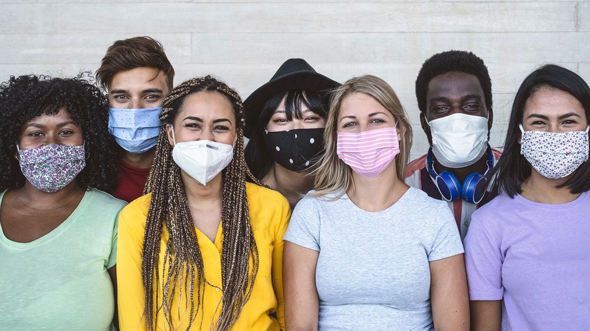
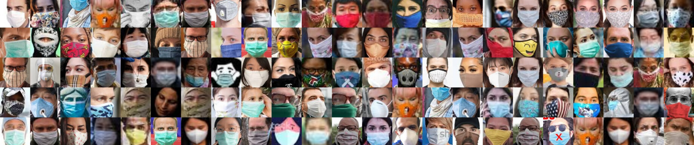
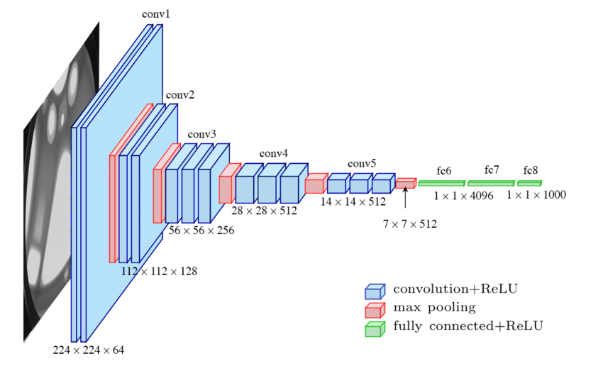

# Face Mask Detection Using VGG16 Architecture

## Introduction

Due to this Covid-19 pandemic, the masks became lifesavers. Nowadays, in most places, masks are compulsory. So, we can take the compulsion as a problem statement for our **computer vision** project.

In this problem statement, we are trying to classify the images of the person in two classes **with a mask** and **without a mask**. So, to solve this classification problem we will use **Supervised Machine Learning** techniques.

## Dataset

For the supervised machine learning problem, we will require labeled good quality data and here kaggle comes into the picture. [Kaggle](https://kaggle.com) is a platform where Data Scientists play with the various datasets and provide some good quality datasets.

The dataset that we are going to use in this project is also from kaggle named [Face Mask ~12K Images Dataset](https://www.kaggle.com/ashishjangra27/face-mask-12k-images-dataset).

## VGG16 architecture

In our problem statement, we are dealing with images. We need to use the [**Convolutional Neural Network (CNN)**](https://en.wikipedia.org/wiki/Convolutional_neural_network) to train the image classification model. CNN contains many convolutional layers and many kernels for each layer. Values of these kernels changes to get the best possible prediction.

[VGG16 Architecture](https://neurohive.io/en/popular-networks/vgg16/) is a winner of the 2014 Imagenet competition which means it is already trained on thousands of images and it has a good set of kernels. So, that's why we are going to use the VGG16 architecture to train our model with a good set kernel. Using weights of other pre-trained models for training new models on the new dataset is the concept of **Transfer Learning**.
