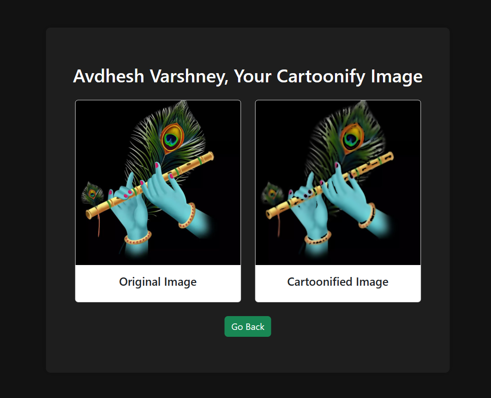

# :zap: Cartoonification Website 

I have created a website for Cartoonify the input images with flask framework as the backend.

### :zap: Tech Stack Used 

#### :zap: Front-end 


#### :zap: Back-end 


### :zap: Key features of this website are:-

1. Frontend features:
  - Taking the input image and name.
  - Having landing page and separate prediction page.

2. Backend features:
  - A POST request is generated using the form in `index.html`. The image is saved in the `upload` folder.
  - Finally, rendering all the prediction and the input image on the webpage.

### :zap: Method of Process 
- Input:
  - Upload the image as provide in the form render on `index.html` file.
- Process:
  - Store the uploaded image in `static/upload` directory with the name of `original-pic.jpg`.
  - Model has scan the image and create the cartoonified image.
  - Also save that Cartoonified image with the name of `cartoon-pic.jpg`.
- Output:
  - Finally, `prediction.html` file will render the both the images.


### :zap: Quick Start 
- Clone this repository
```css
git clone https://github.com/<Your-GitHub-UserName>/Face-X.git
```
- Install python version 3.9 or higher versions.
- Install Virtual Environment using the below command line.
```css
python -m venv <virtual-environment-name>
```
- Activate the Environment in command line.
```css
.\<virtual-environment-name>\Scripts\activate
```
- If error occurs, use the following commands.
```css
Set-ExecutionPolicy -Scope Process -ExecutionPolicy Bypass
```
- In activated environment, install all python dependencies.
```css
pip install -r requirements.txt
```
- Run code file using below command.
```css
python app.py
```


### :zap: Output Screenshot 



### :zap: Preview of Website 


## ❤️ Project Contributor 

<h4 align='center'>Developed By <b><i>Avdhesh Varshney</i></b> 👦</h4>
<p align='center'>
  <a href='https://www.linkedin.com/in/avdhesh-varshney'>
    
  </a>
  <a href='https://www.github.com/Avdhesh-Varshney'>
    
  </a>
</p>
