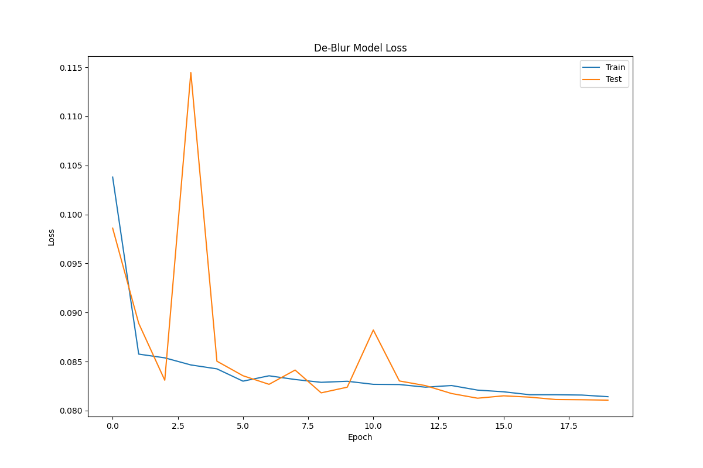
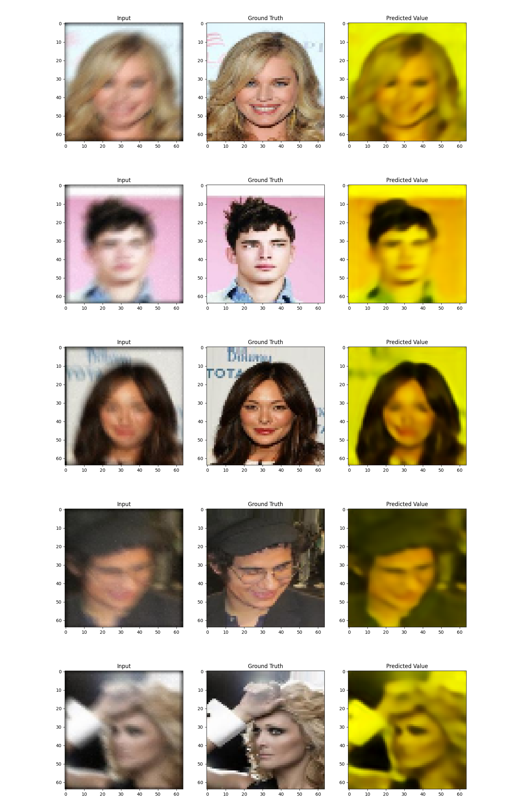
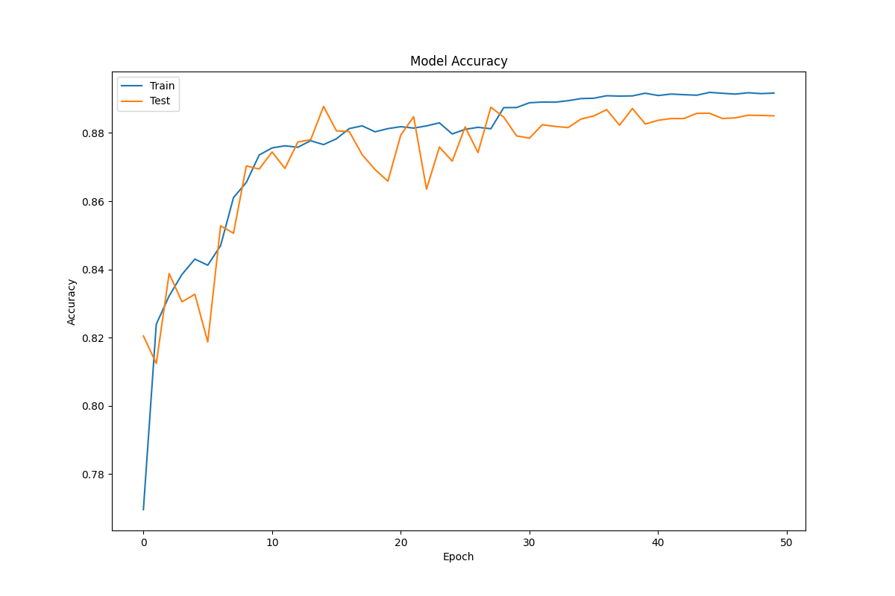
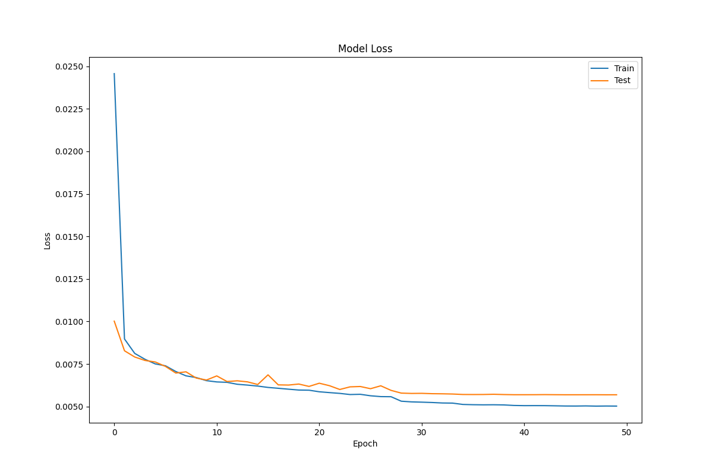
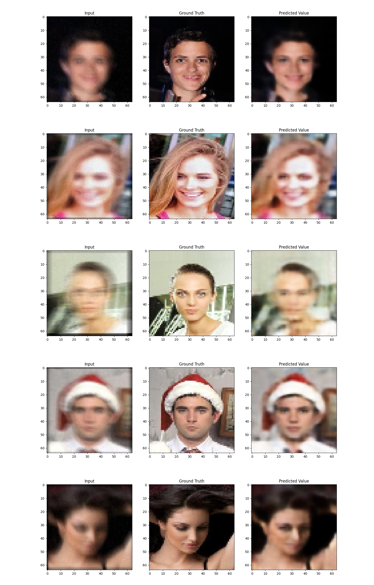
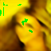
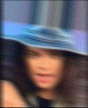
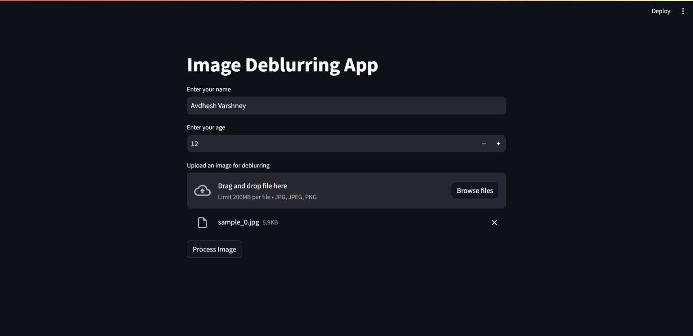

# :zap: De-Blurring Model Deployed Website 

I have deployed a image processing model by packing their weights in a file and convert it into a interactive website for De-Blurring the input images with streamlit framework as the frontend.

### :zap: Tech Stack Used 

#### :zap: Front-end 


#### :zap: Back-end 


### :zap: Key features of this website are:-

1. Frontend features:
   - Input: A image and the name and age of the user.
   - Well maintained landing page of streamlit framework.

2. Backend features:
   - A POST request is generated using the form in `app.py` python file using streamlit framework.
   - The image is passed to the model which generate the sharp image.
   - Finally, rendering all the generated image and the input image on the webpage.


### :zap: Quick Start 
- Clone this repository
```css
git clone https://github.com/<Your-GitHub-UserName>/Face-X.git
```
- Install python version 3.9 or higher versions.
- Install Virtual Environment using the below command line.
```css
python -m venv <virtual-environment-name>
```
- Activate the Environment in command line.
```css
.\<virtual-environment-name>\Scripts\activate
```
- If error occurs, use the following commands.
```css
Set-ExecutionPolicy -Scope Process -ExecutionPolicy Bypass
```
- In activated environment, install all python dependencies.
```css
pip install -r requirements.txt
```
- Run code file using below command.
```css
streamlit run app.py
```


### :zap: Results 

#### :zap: De Blur CNN Model - 1

<table>
  <tr>
    <td></td>
    <td></td>
  </tr>
  <tr>
    <td colspan="2" style="text-align: center;"></td>
  </tr>
</table>

#### :zap: Auto encoder CNN Model - 2

<table>
  <tr>
    <td></td>
    <td></td>
  </tr>
  <tr>
    <td colspan="2" style="text-align: center;"></td>
  </tr>
</table>

### :zap: Predictions Done by Website 

<table>
  <tr>
    <td></td>
    <td></td>
    <td></td>
  </tr>
  <tr>
    <td></td>
    <td></td>
    <td></td>
  </tr>
  <tr>
    <td></td>
    <td></td>
    <td></td>
  </tr>
</table>


### :zap: Preview of Website 




## ❤️ Project Contributor 

<h4 align='center'>Developed By <b><i>Avdhesh Varshney</i></b> 👦</h4>
<p align='center'>
  <a href='https://www.linkedin.com/in/avdhesh-varshney'>
    
  </a>
  <a href='https://www.github.com/Avdhesh-Varshney'>
    
  </a>
</p>
