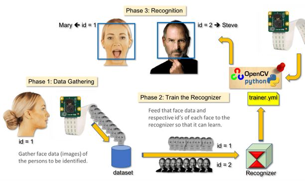
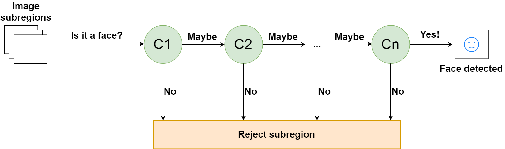
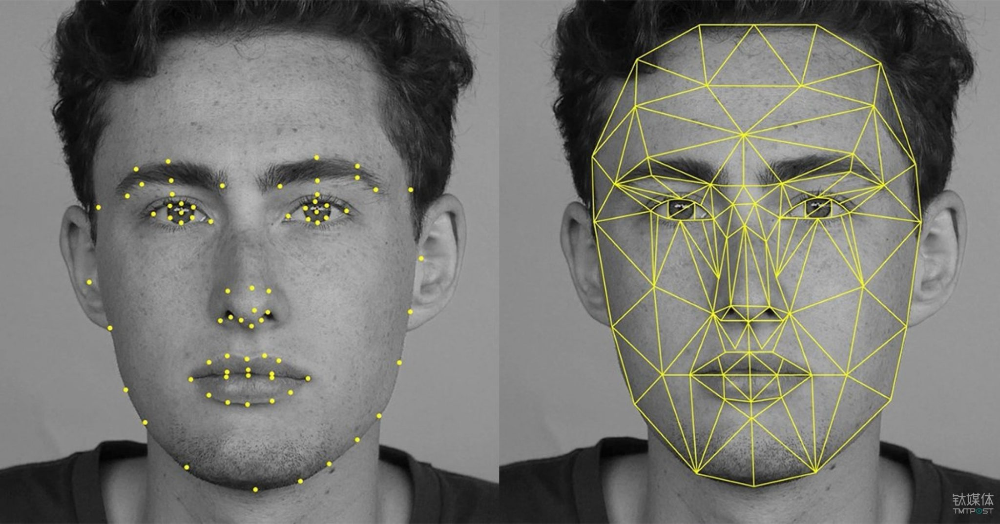

# Face Biometric using OpenCV


## 1. Introduction

Face recognition is the technique in which the identity of a human being can be identified using ones individual face. Such kind of systems can be used in photos, videos, or in real time machines. The objective of this article is to provide a simpler and easy method in machine technology. With the help of such a technology one can easily detect the face by the help of dataset in similar matching appearance of a person. The method in which with the help of python and OpenCV in deep learning is the most efficient way to detect the face of the person. This method is useful in many fields such as the military, for security, schools, colleges and universities, airlines, banking, online web applications, gaming etc. this system uses powerful python algorithm through which the detection and recognition of face is very easy and efficient.

This repository detects a human face using Dlib's 68 points model. As the human face is way too complex for a computer to learn, so we have used the 68 points model to ease the process of facial recognition. Facial Biometric uses a two step biometric process for facial recognition.
These steps are:

- Facial localization to locate a human face and return `4(x,y)-coordinates` that forms a rectangle bounding the face.
- Detecting facial structures using Dlib's 68 points model.

## 2. Dlib's 68 points model

The below image is an example of Dlib's 68 points model. This pre-trained facial landmark detector inside the Dlib's library is used to estimate the location of 68(x,y)-coordinates that maps to the different facial structures.


### 1. Facial landmark points detection through Dlib's 68 Model:

There are mostly two steps to detect face landmarks in an image which are given below:

- Face detection: Face detection is the first methods which locate a human face and return a value in `x,y,w,h` which is a rectangle. 
<a href="https://learnopencv.com/face-detection-opencv-dlib-and-deep-learning-c-python/">Read more</a>
- Face landmark: After getting the location of a face in an image, then we have to through points inside of that rectangle.
<a href="https://learnopencv.com/facial-landmark-detection/">Read more</a>


There are many methods of face detector but we focus in this post only one which is Dlib's method. Like, Opencv uses methods LBP cascades and HAAR and Dlib's use methods HOG `(Histogram of Oriented Gradients)`and SVM `(Support Vector Machine)`.

Now to draw landmarks on the face of the detected rectangle, we are passing the landmarks values and image to the facePoints. In the below code, we are passing landmarks and image as a parameter to a method called drawPoints which accessing the coordinates(x,y) of the ith landmarks points using the `part(i).x` and `part(i).y`. All landmarks points are saved in a numpy array and then pass these points to in-built `cv2.polyline` method to draw the lines on the face using the startpoint and endpoint parameters.

## 3.What is Face Detection ?

Face detection is a type of computer vision technology that is able to identify people’s faces within digital images. This is very easy for humans, but computers need precise instructions. The images might contain many objects that aren’t human faces, like buildings, cars, animals, and so on.

It is distinct from other computer vision technologies that involve human faces, like facial recognition, analysis, and tracking :

- `Facial recognition` : involves identifying the face in the image as belonging to person X and not person Y. It is often used for biometric purposes, like unlocking your smartphone.Given a small example of facial recognition how it actually being works.


Face recognition systems use computer algorithms to pick out specific, distinctive details about a person’s face. These details, such as distance between the eyes or shape of the chin, are then converted into a mathematical representation and compared to data on other faces collected in a face recognition database. The data about a particular face is often called a face template and is distinct from a photograph because it’s designed to only include certain details that can be used to distinguish one face from another. 
  Some face recognition systems, instead of positively identifying an unknown person, are designed to calculate a probability match score between the unknown person and specific face templates stored in the database. These systems will offer up several potential matches, ranked in order of likelihood of correct identification, instead of just returning a single result. 
  Face recognition systems vary in their ability to identify people under challenging conditions such as poor lighting, low quality image resolution, and suboptimal angle of view (such as in a photograph taken from above looking down on an unknown person).
When it comes to errors, there are two key concepts to understand: 
  A “false negative” is when the face recognition system fails to match a person’s face to an image that is, in fact, contained in a database. In other words, the system will erroneously return zero results in response to a query.
  A “false positive” is when the face recognition system does match a person’s face to an image in a database, but that match is actually incorrect. This is when a police officer submits an image of “X” but the system erroneously tells the officer that the photo is of “Y” 
  When researching a face recognition system, it is important to look closely at the “false positive” rate and the “false negative” rate, since there is almost always a trade-off. For example, if you are using face recognition to unlock your phone, it is better if the system fails to identify you a few times (false negative) than it is for the system to misidentify other people as you and lets those people unlock your phone (false positive). If the result of misidentification is that an innocent person goes to jail (like a misidentification in a mugshot database), then the system should be designed to have as few false positives as possible. <a href="https://learnopencv.com/face-detection-opencv-dlib-and-deep-learning-c-python/">Read more</a>

 


- `Facial analysis` : tries to understand something about people from their facial features, like determining their age, gender, or the emotion they are displaying.It ia an intersection between computer vision, Machine Learning and Image processing fields that aims to extract any kind of information from human face except his/her identity such as emotion, engagement, vitals measurement, demographics information age and gender.


Facial expressions can be collected and analyzed in three different ways:

1. By tracking of facial electromyographic activity (FEMG)
2. live observation and manual coding of facial activity.
3. automatic facial expression analysis using computer-vision.
  <p><a href="https://learnopencv.com/age-gender-classification-using-opencv-deep-learning-c-python/">read more</a></p>
  <p><a href="https://recfaces.com/articles/emotion-recognition">facial analysis</a></p>

- `Facial tracking` : is mostly present in video analysis and tries to follow a face and its features (eyes, nose, and lips) from frame to frame. The most popular applications are various filters available in mobile apps like Snapchat.

To create a complete project on Face Recognition, we must work on 3 very distinct phases:
- Face Detection and Data Gathering
- Train the Recognizer
- Face Recognition
  The below block diagram resumes those phases:
  
    <p><a href="https://learnopencv.com/create-snapchat-instagram-filters-using-mediapipe/">Read more</a></p>



## 4.How Do Computers “See” Images?

The smallest element of an image is called a pixel, or a picture element. It is basically a dot in the picture. An image contains multiple pixels arranged in rows and columns.
You will often see the number of rows and columns expressed as the image resolution. For example, an Ultra HD TV has the resolution of 3840x2160, meaning it is 3840 pixels wide and 2160 pixels high.

But a computer does not understand pixels as dots of color. It only understands numbers. To convert colors to numbers, the computer uses various color models. In color images, pixels are often represented in the RGB color model. RGB stands for Red Green Blue. Each pixel is a mix of those three colors. RGB is great at modeling all the colors humans perceive by combining various amounts of red, green, and blue.

Since a computer only understand numbers, every pixel is represented by three numbers, corresponding to the amounts of red, green, and blue present in that pixel. In grayscale (black and white) images, each pixel is a single number, representing the amount of light, or intensity, it carries. In many applications, the range of intensities is from 0 (black) to 255 (white). Everything between 0 and 255 is various shades of gray.

If each grayscale pixel is a number, an image is nothing more than a matrix (or table) of numbers:


Example 3x3 image with pixel values and colors

In color images, there are three such matrices representing the red, green, and blue channels.

## 5.Cascading Classifiers

The definition of a cascade is a series of waterfalls coming one after another. A similar concept is used in computer science to solve a complex problem with simple units. The problem here is reducing the number of computations for each image.

When an image subregion enters the cascade, it is evaluated by the first stage. If that stage evaluates the subregion as positive, meaning that it thinks it’s a face, the output of the stage is maybe. If a subregion gets a maybe, it is sent to the next stage of the cascade. If that one gives a positive evaluation, then that’s another maybe, and the image is sent to the third stage:


### A weak classifier in a cascade :

This process is repeated until the image passes through all stages of the cascade. If all classifiers approve the image, it is finally classified as a human face and is presented to the user as a detection.

If, however, the first stage gives a negative evaluation, then the image is immediately discarded as not containing a human face. If it passes the first stage but fails the second stage, it is discarded as well. Basically, the image can get discarded at any stage of the classifier:



### A cascade of n classifiers for face detection :

This is designed so that non-faces get discarded very quickly, which saves a lot of time and computational resources. Since every classifier represents a feature of a human face, a positive detection basically says, “Yes, this subregion contains all the features of a human face.” But as soon as one feature is missing, it rejects the whole subregion.

To accomplish this effectively, it is important to put your best performing classifiers early in the cascade. In the Viola-Jones algorithm, the eyes and nose bridge classifiers are examples of best performing weak classifiers.

<p><a href="https://docs.opencv.org/3.4/dc/d88/tutorial_traincascade.html">Read more</a></p>

### Import OpenCV and load the image into memory:

```
import cv2 as cv

# Read image from your local file system
original_image = cv.imread('path/to/your-image.jpg')

# Convert color image to grayscale for Viola-Jones
grayscale_image = cv.cvtColor(original_image, cv.COLOR_BGR2GRAY)

```

Depending on the version, the exact path might vary, but the folder name will be haarcascades, and it will contain multiple files. The one you need is called `haarcascade_frontalface_alt.xml`.

If for some reason, your installation of OpenCV did not get the pre-trained classifier,

```
# Load the classifier and create a cascade object for face detection
face_cascade = cv.CascadeClassifier('path/to/haarcascade_frontalface_alt.xml')
```

The face_cascade object has a method `detectMultiScale()`, which receives an image as an argument and runs the classifier cascade over the image. The term MultiScale indicates that the algorithm looks at subregions of the image in multiple scales, to detect faces of varying sizes:

`detected_faces = face_cascade.detectMultiScale(grayscale_image)`

The variable detected_faces now contains all the detections for the target image. To visualize the detections, you need to iterate over all detections and draw rectangles over the detected faces.

OpenCV’s `rectangle()` draws rectangles over images, and it needs to know the pixel coordinates of the top-left and bottom-right corner. The coordinates indicate the row and column of pixels in the image.

Luckily, detections are saved as pixel coordinates. Each detection is defined by its top-left corner coordinates and width and height of the rectangle that encompasses the detected face.

Adding the width to the row and height to the column will give you the bottom-right corner of the image:

```
for (column, row, width, height) in detected_faces:
    cv.rectangle(
        original_image,
        (column, row),
        (column + width, row + height),
        (0, 255, 0),
        2
    )
```

rectangle() accepts the following arguments:

- The original image
- The coordinates of the top-left point of the detection
- The coordinates of the bottom-right point of the detection
- The color of the rectangle (a tuple that defines the amount of red, green, and blue (0-255))
- The thickness of the rectangle lines

Finally, you need to display the image:

```
cv.imshow('Image', original_image)
cv.waitKey(0)
cv.destroyAllWindows()
```

`imshow()` displays the image. `waitKey()` waits for a keystroke. Otherwise, `imshow()` would display the image and immediately close the window. Passing 0 as the argument tells it to wait indefinitely. Finally, `destroyAllWindows()` closes the window when you press a key.

## 6.How to get started

- Clone this repository-
  `git clone https://github.com/akshitagupta15june/Face-X.git`
- Change Directory-
  `cd Facial_Biometric`

- Run file-
  `python library.py`

- Input name-
  `Type your name in the input dialogue opened in the terminal`

## Requirements

- python 3.6+
- opencv
- dlib

`Note` : This file takes input video from your webcam and detects the points, So you need an inbuilt or externally connected webcam

## Installation

- Create virtual environment-

```
- `python -m venv env`
- `source env/bin/activate`  (Linux)
- `pip install opencv-python==4.4.0.44`
- `pip install dlib==19.21.1`
- `pip install opencv-python==4.4.0.44`
```

```
Note : dlib is a library written in c++ that used applications like cmake,boost etc.,if you face any error while installing dlib, don't panic and try to install the extensions required.
```

## 7.Code Overview :

```
import cv2
import dlib

detector = dlib.get_frontal_face_detector()

predictor = dlib.shape_predictor("./shape_predictor_68_face_landmarks.dat")
name = input("Enter your name: ")
cap = cv2.VideoCapture(0)

while True:

    ret, frame = cap.read()
    gray = cv2.cvtColor(frame, cv2.COLOR_BGR2GRAY)

    faces = detector(gray)

    for face in faces:
        x1=face.left()
        y1=face.top()
        x2=face.right()
        y2=face.bottom()
        cv2.rectangle(frame, (x1,y1), (x2,y2),(0,255,0),3)
        landmarks = predictor(gray, face)
        # print(landmarks.parts())
        nose = landmarks.parts()[27]
        # print(nose.x, nose.y)
        cv2.putText(frame,str(name),(x1, y1 - 10), cv2.FONT_HERSHEY_COMPLEX, 1, (255, 0, 0), 2)
        for point in landmarks.parts():
            cv2.circle(frame, (point.x, point.y), 2, (0, 0, 255), 3)

    # print(faces)

    if ret:
        cv2.imshow("My Screen", frame)

    key = cv2.waitKey(1)

    if key == ord("q"):
        break

cap.release()
cv2.destroyAllWindows()

```

## 8.Result Obtain:




<p style="clear:both;">
<h1><a name="contributing"></a><a name="community"></a> <a href="https://github.com/akshitagupta15june/Face-X">Community</a> and <a href="https://github.com/akshitagupta15june/Face-X/blob/master/CONTRIBUTING.md">Contributing</a></h1>
<p>Please do! Contributions, updates, <a href="https://github.com/akshitagupta15june/Face-X/issues"></a> and <a href=" ">pull requests</a> are welcome. This project is community-built and welcomes collaboration. Contributors are expected to adhere to the <a href="https://gssoc.girlscript.tech/">GOSSC Code of Conduct</a>.
</p>
<p>
Jump into our <a href="https://discord.com/invite/Jmc97prqjb">Discord</a>! Our projects are community-built and welcome collaboration. 👍Be sure to see the <a href="https://github.com/akshitagupta15june/Face-X/blob/master/Readme.md">Face-X Community Welcome Guide</a> for a tour of resources available to you.
</p>
<p>
<i>Not sure where to start?</i> Grab an open issue with the <a href="https://github.com/akshitagupta15june/Face-X/issues">help-wanted label</a>
</p>
