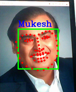

## Facial Biometric
 This repository will detect and mark the 68 points in human faces using dlib's pre-trained model.Since, human face is too complex for a computer to learn, a set of 68 points are learned and used to recognise each and every facial feature as shown below.

 
 
 
 Some examples of the output of the facial_biometric are shown below.

 


 "shape_predictor_68_face_landmarks.dat" contains the pre-trained predictor which will be loaded using dlib library.

## How to get started

- Clone this repository-
`git clone https://github.com/akshitagupta15june/Face-X.git`
- Change Directory-
`cd Facial_Biometric`

- Run file-
`python library.py`

## Requirements

- python 3.6+
- opencv
- dlib

`Note : This file takes input video from your webcam and detects the points, So you need an inbuilt or externally connected webcam`

## Installation 

- Create virtual environment-
```
- `python -m venv env`
- `source env/bin/activate`  (Linux)
- `pip install opencv-python==4.4.0.44`
- `pip install dlib==19.21.1`
- `pip install opencv-python==4.4.0.44`

```
`Note : dlib is a library written in c++ that used applications like cmake,boost etc.,if you face any error while installing, don't panic and try to install the extensions required.`

