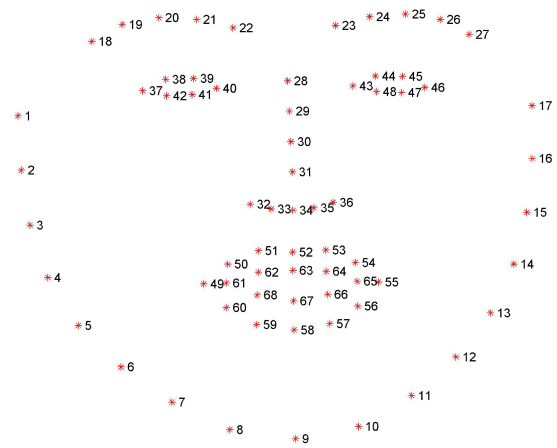
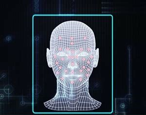
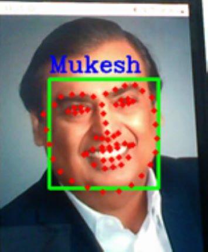
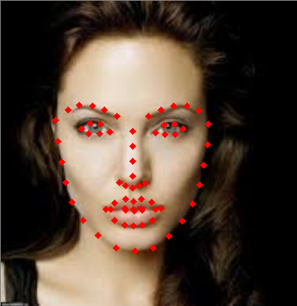

## Facial Biometric

 This repository detects a human face using Dlib's 68 points model. As the human face is way too complex for a computer to learn, so we have used the 68 points model to ease the process of facial recognition. Facial Biometric uses a two step biometric process for facial recognition. 
 These steps are:
 1. Facial localization to locate a human face and return 4(x,y)-coordinates that forms a rectangle bounding the face.
 2. Detecting facial structures using Dlib's 68 points model. 

## Dlib's 68 points model

 The below image is an example of Dlib's 68 points model. This pre-trained facial landmark detector inside the Dlib's library is used to estimate the location of 68(x,y)-coordinates that maps to the different facial structures. 


 
 
## Facial localization
 
 
 
 
 ## Detecting Facial Landmarks
 
 Some examples of the output generated by the Facial_biometric are shown below.

 





## How to get started

- Clone this repository-
`git clone https://github.com/akshitagupta15june/Face-X.git`
- Change Directory-
`cd Facial_Biometric`

- Run file-
`python library.py`

- Input name-
`Type your name in the input dialogue opened in the terminal`

## Requirements

- python 3.6+
- opencv
- dlib

`Note` : This file takes input video from your webcam and detects the points, So you need an inbuilt or externally connected webcam

## Installation 


- Create virtual environment-
```
- `python -m venv env`
- `source env/bin/activate`  (Linux)
- `pip install opencv-python==4.4.0.44`
- `pip install dlib==19.21.1`
- `pip install opencv-python==4.4.0.44`
```

`Note' : dlib is a library written in c++ that used applications like cmake,boost etc.,if you face any error while installing dlib, don't panic and try to install the extensions required.

