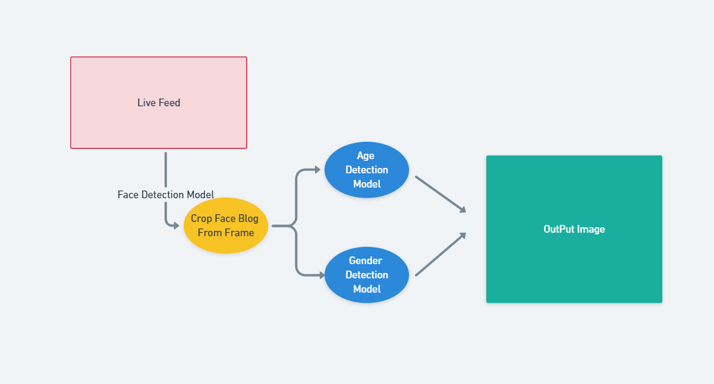

# Real Time Age Calculator (Face-X)

**Task** : To find the age of the person in the real time feed.

## How does it work ? 
Our goal here is to predict the age of a person just by looking at the image.  
You might think that it is a regression task, right?  
But, interestingly enough we and also researchers take this as a classification problem.
#### Let's try to understand : Why ? 
Using an image to predict age has many uncertainties or variables so to speak, like : 
- Camera quality 
- Lighting, Brightness and other filters
Or maybe the person looks quite old despite being young and vice versa. So in conclusion accuracy of age calculation would be very less in real world case if treated it as a regression problem.
 
So instead we create age ranges like 0-20 , 25-30 etc and try to classify our image into one of these categories and we find that it is much more accurate and useful in real world scenario.

## Workflow

## What does each script do?
In the Models directory we have some various types of file, their uses are described below: 
- **pb or pbtxt files** : pb stands for protobuf. In TensorFlow, the protbuf file contains the graph definition as well as the weights of the model. Thus, a pb file is all you need to be able to run a given trained model(pbtxt means that it is in text format instead of binary).
- **caffemodel** : A CAFFEMODEL file is a machine learning model created by Caffe. It contains an image classification or image segmentation model that has been trained using Caffe.
- **proto file** : basically  PROTOTXT files are used to create .CAFFEMODEL files.  
_<u>Note: Caffe is a deep learning framework, originally developed at University of California, Berkeley. It is open source, under a BSD license. It is written in C++, with a Python interface.</u>_

## Result/Working :
#### Output On an Image: 

#### Output On Webcam - Live Feed : 

### Resources That You can refer
- Age Calculation and Gender Detection : https://data-flair.training/blogs/python-project-gender-age-detection/
- OpenCv Documentation : https://opencv.org/

### Contribution By : 
Yagyesh Bobde   
  
 
