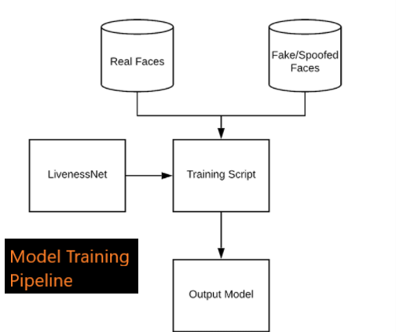
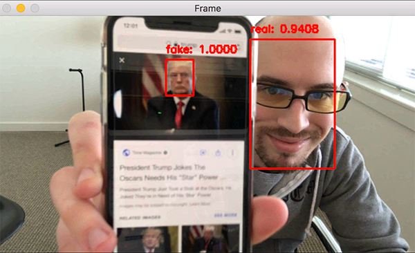

# Real time liveness based face recognition system:

## Task:
Create a liveness detector capable of spotting fake faces and performing anti-face spoofing in face recognition systems.

## What is liveness detection and why do we need it?
Facial recognition software are gaining popularity and are increasing being implemented in various software and applications.    
However, face recognition systems are easily fooled by “spoofing” and “non-real” faces. Hence comes the need for a system to determine whether the face is real or not.  

**Q. How would you go about spotting these “fake” versus “real/legitimate” faces? How could you apply anti-face spoofing algorithms into your facial recognition applications?**
 The answer is to apply liveness detection with OpenCV which is exactly what I’ll be covering today.

There are a number of approaches to liveness detection, including:
- Texture analysis
- Frequency analysis
- Variable focusing analysis
- Heuristic-based algorithms
- Optical Flow algorithms
- 3D face shape
- Combinations of the above
A full review of liveness detection algorithms can be found in Chakraborty and Das’ 2014 paper, [An Overview of Face liveness Detection](https://arxiv.org/pdf/1405.2227.pdf)

<u>Here we’ll be treating liveness detection as a binary classification problem.</u>
## Workflow:

1. Build the image dataset itself.
2. Implement a CNN capable of performing liveness detector (we’ll call this network “LivenessNet”).
3. Train the liveness detector network.

4. Create a Python + OpenCV script capable of taking our trained livenes detector model and apply it to real-time video.

## Project coming Together :
The final step is to combine all the pieces:
1. We’ll access our webcam/video stream
2. Apply face detection to each frame
3. For each face detected, apply our liveness detector model
## What does each script do?!:

1. `gather_examples.py` : This script grabs face ROIs from input video files and helps us to create a deep learning face liveness dataset.
    
2. `train.py` : As the filename indicates, this script will train our LivenessNet classifier. We’ll use Keras and TensorFlow to train the model. The training process results in a few files:

    i. `le.pickle`: Our class label encoder.
        
    ii. `liveness.model`: Our serialized Keras model which detects face liveness.
        
    iii. `plot.png`: The training history plot shows accuracy and loss curves so we can assess our model (i.e. over/underfitting).

3. `liveness_demo.py`: Our demonstration script will fire up your webcam to grab frames to conduct face liveness detection in real-time.

## Dependencies:

* Python 3, [OpenCV](https://opencv.org/), [Tensorflow](https://www.tensorflow.org/)

## Graph:

#### A plot of training a face liveness model using OpenCV, Keras and deep learning

## Output:

## Credits:

To read a more detailed version of this for better understanding, read [PyImageSearch](https://www.pyimagesearch.com/2019/03/11/liveness-detection-with-opencv/)
