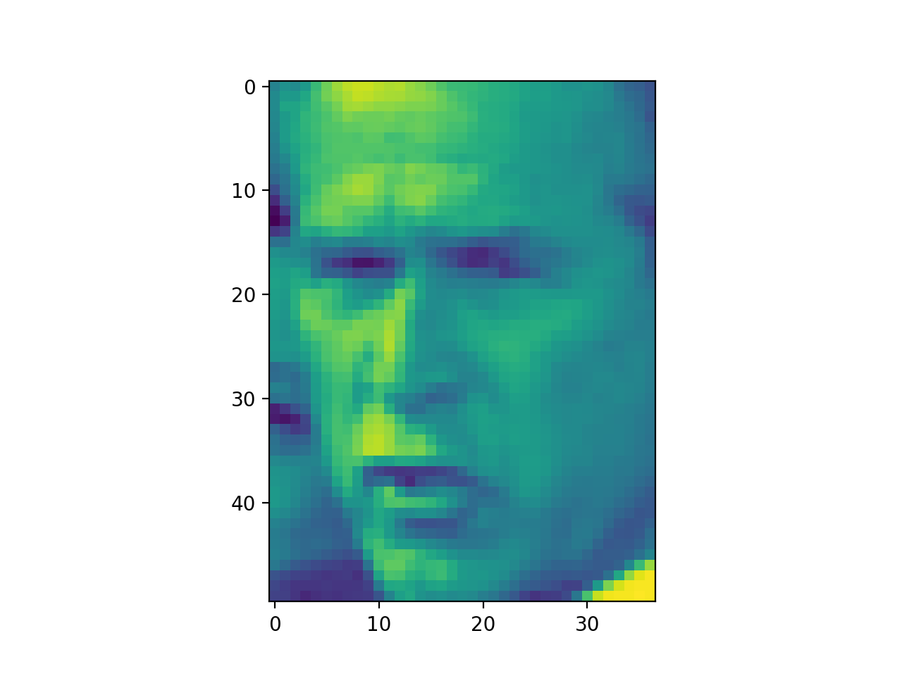
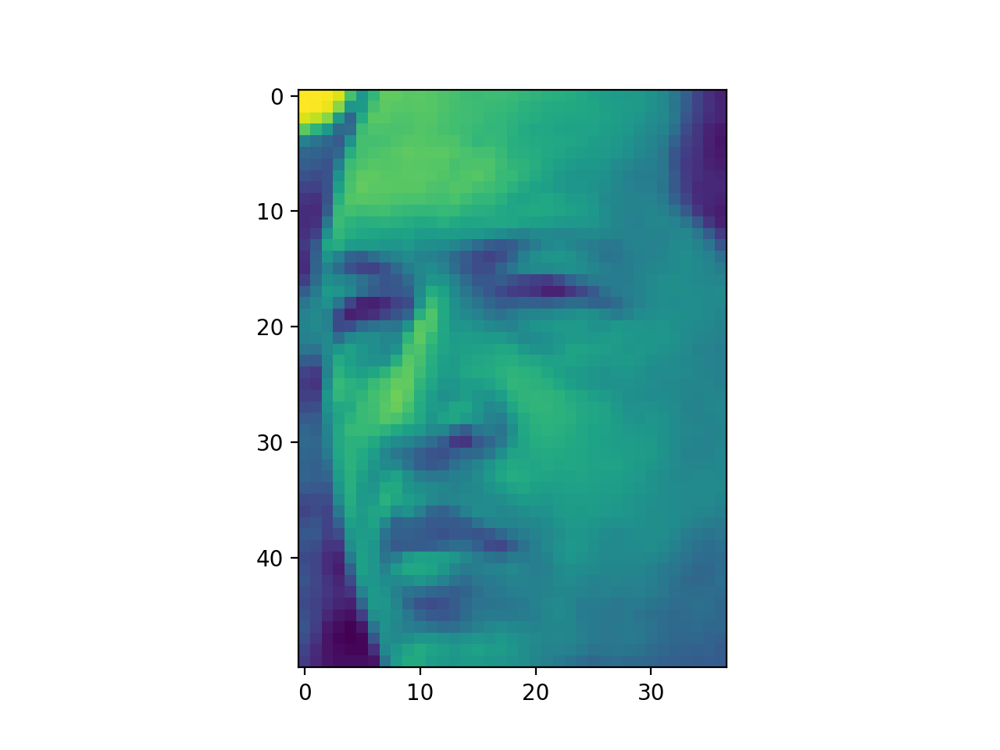
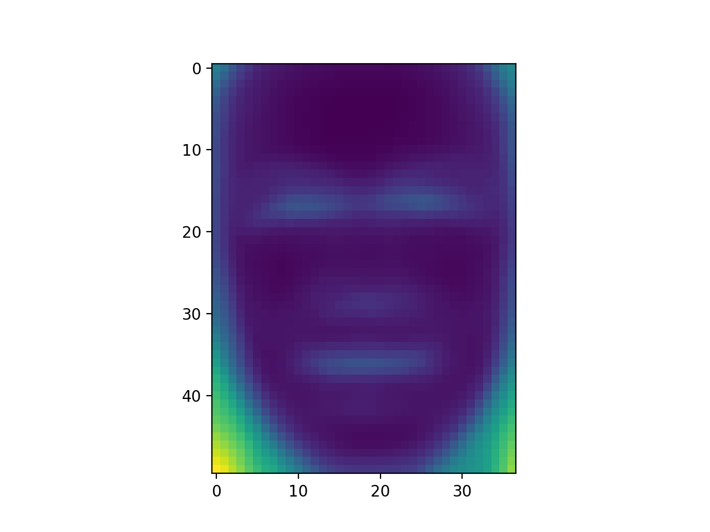
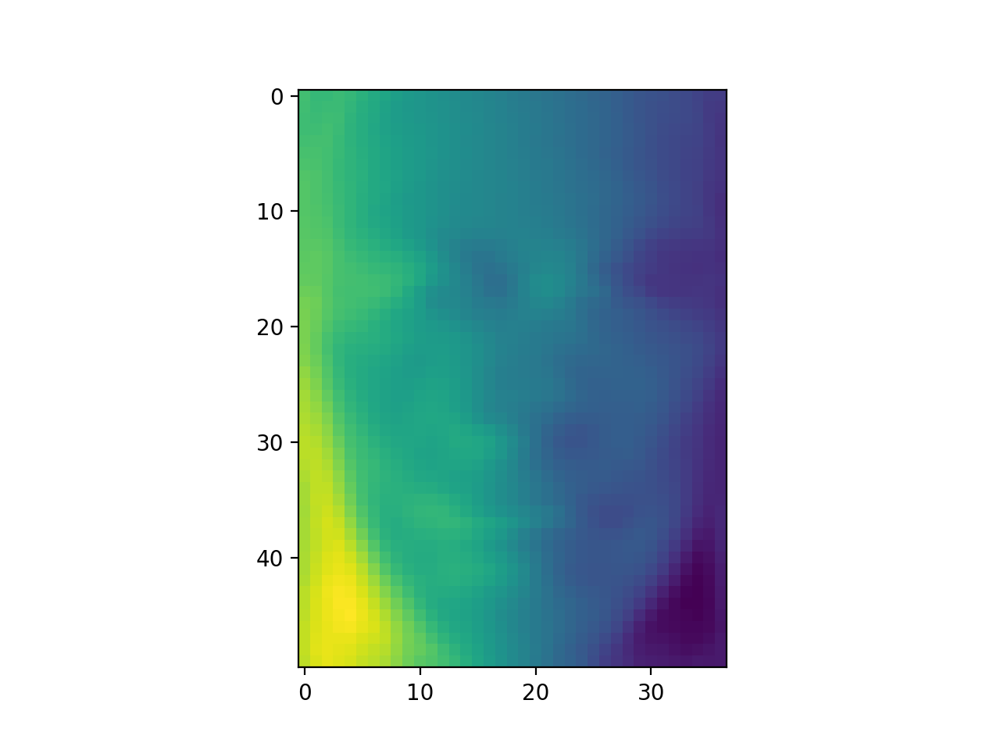

# Eigen Faces
The following is a Demonstration of Principal Component Analysis, dimensional reduction. The following has been developed in python2.7 however can be run on machines which use Python3, by using a python virtual environment

This project is based on the following paper:- 
[Face recognition using eigenfaces by Matthew A. Turk and Alex P. Pentland](https://ieeexplore.ieee.org/document/139758)

Dataset courtesy - http://vis-www.cs.umass.edu/lfw/

### Development
The following can be best developed using `pipenv`. If you do not have `pipen`, simply run the following command (using pip3 or pip based on your version of Python)
```
pip install pipenv
```

Then clone the following repository
```
git clone https://github.com/sahitpj/EigenFaces
```

Then change the following working directory and then run the following commands

```
pipenv install --dev
```

This should have installed all the necessary dependencies for the project. If the pipenv shell doesn't start running after this, simply run the following command

```
pipenv shell
```

Now in order to run the main program run the following command

```
pipenv run python main.py
```

Make sure to use python and not python3 because the following pip environment is of Python2.7. Any changes which are to be made, are to documented and make sure to lock dependencies if dependencies have been changed during the process.

```
pipenv lock
```

The detailed report about this, can be viewd [here](REPORT.md)
or can be found at https://sahitpj.github.io/EigenFaces

If you like this repository and find it useful, please consider &#9733; starring it :)

project repo link - https://github.com/sahitpj/EigenFaces


# Principal Component Analysis 

Face Recognition using Eigen Faces - Matthew A. Turk and Alex P. Pentland 

## Abstract 

In this project I would like to demonstarte the use of Principal Component Analysis, a method of dimensional reduction in order to help us create a model for Facial Recognition. The idea is to project faces onto a feature space which best encodes them, these features spaces mathematically correspond to the eigen vector space of these vectors.

We then use the following projections along with Machine Learning techniques to build a Facial Recognizer.

We will be using Python to help us develop this model.

## Introduction 

Face Structures are 2D images, which can be represented as a 3D matrix, and can be reduced to a 2D space, by converting it to a greyscale image. Since human faces have a huge amount of variations in extremely small detail shifts, it can be tough to identify to minute differences in order to distinguish people two people's faces. Thus in order to be sure that a machine learning can acquire the best accuracy, the whole of the face must be used as a feature set. 

Thus in order to develop a Facial Recognition model which is fast, reasonably simple and is quite accurate, a method of pattern Recognition is necessary.

Thus the main idea is to transform these images, into features images, which we shall call as **Eigen Faces** upon which we apply our learning techniques.

## Eigen Faces

In order to find the necessary **Eigen Faces** it would be necessary to capture the vriation of the features in the face without and using this to encode our faces.

Thus mathematically we wish to find the principal components of the distribution. However rather than taking all of the possible Eigen Faces, we choose the best faces. why? computationally better.

Thus our images, can be represented as a linear combination of our selected eigen faces. 

## Developing the Model 

### Initialization

For the followoing we first need a dataset. We use `sklearn` for this, and use the following `lfw_people` dataset. Firstly we import the `sklearn` library


```
from sklearn.datasets import fetch_lfw_people
```

The following datset contains images of people

```
no_of_sample, height, width = lfw_people.images.shape
data = lfw_people.data
labels = lfw_people.target
```

We then import the plt function in matplotlib to plot our images

```
import matplotlib.pyplot as plt

plt.imshow(image_data[30, :, :]) #30 is the image number
plt.show()
```



```
plt.imshow(image_data[2, :, :]) 
plt.show()
```



We now understand see our labels, which come out of the form as number, each number referring to a specific person.

```
jayakrishnasahit@Jayakrishna-Sahit in ~/Documents/Github/Eigenfaces on master [!?]$ python main.py
these are the label [5 6 3 ..., 5 3 5]
target labels ['Ariel Sharon' 'Colin Powell' 'Donald Rumsfeld' 'George W Bush'
 'Gerhard Schroeder' 'Hugo Chavez' 'Tony Blair']
```

We now find the number of samples and the image dimensions

```
oem@Meha in ~/Documents/Github/Eigenfaces on master [!?]$ python main.py
number of images 1288
image height and width 50 37
```

### Applying Principal Component Analysis

Now that we have our data matrix, we now apply the Principal Component Analysis method to obtain our Eigen Face vectors. In order to do so we first need to find our eigen vectors. 

1. First we normalize our matrix, with respect to each feature. For this we use the sklearn normalize function. This subtracts the meam from the data and divides it by the variance

```
from sklearn.preprocessing import normalize

sk_norm = normalize(data, axis=0)
```


2. Now that we have our data normalized we can now apply PCA. Firstly we compute the covariance matrix, which is given by 

```
Cov = 1/m(X'X)
```

where m is the number of samples, X is the feature matrix and X' is the transpose of the feature matrix. We now perform this with the help of the numpy module.

```
import numpy as np 

cov_matrix = matrix.T.dot(matrix)/(matrix.shape[0])
```
the covariance matirx has dimensions of nxn, where n is the number of features of the original feature matrix.

3. Now we simply have to find the eigen vectors of this matrix. This can be done using the followoing

```
values, vectors = np.linalg.eig(cov_matrix)
```

The Eigen vectors form the Eigen Face Space and when visualised look something like this.





Now that we have our Eigen vector space, we choose the top k number of eigen vectors. which will form our projection space. 

```
pca_vectors = vectors[:, :red_dim]
```

Now in order to get our new features which have been projected on our new eigen space, we do the following

```
pca_vectors = matrix.dot(eigen_faces) 
```

We now have our PCA space ready to be used for Face Recognition

### Applying Facial Recognition

Once we have our feature set, we now have a classification problem at our hands. In this model I will be developing a K Nearest Neighbour model (Disclaimer! - This may not be the best model to use for this dataset, the idea is to understand how to implement it)

Using out sklearn library we split our data into train and test and then apply our training data for the Classifier. 

```
from sklearn.model_selection import train_test_split
from sklearn.neighbors import KNeighborsClassifier

X_train, X_test, y_train, y_test = train_test_split(pca_vectors, labels, random_state=42)

knn = KNeighborsClassifier(n_neighbors=10)
knn.fit(X_train, y_train)
```

And we then use the trained model on the test data

```
print 'accuracy', knn.score(X_test, y_test)
```

```
oem@Meha in ~/Documents/Github/Eigenfaces on master [!?]$ python main.py
accuracy 0.636645962733
```
