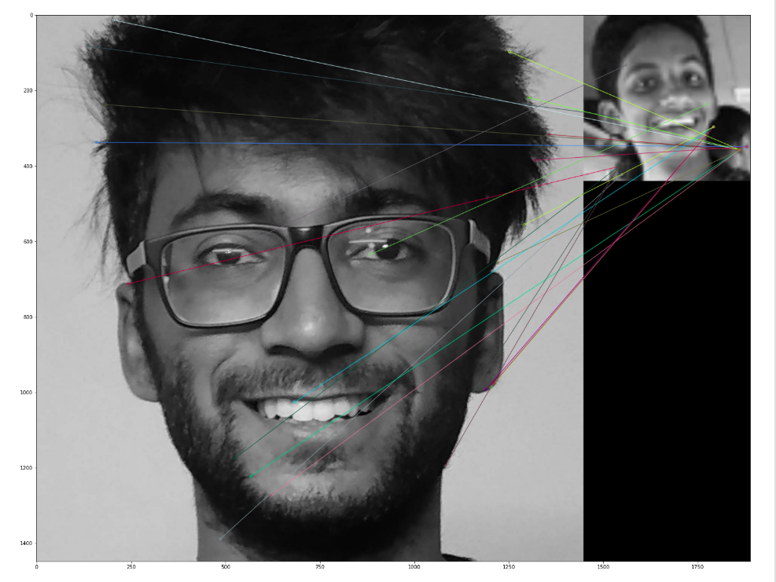

# Facial-recognition-using-SIFT
This is an experimental facial recognition project by matching the features extracted using SIFT. 

### Dependencies
1. numpy
2. opencv-contrib-python version 3.4.2.16
3. pnslib

### Brief
Two images are taken as input. For now, only images consisting of a single face are considered. The images are passed through a face detection algorithm. For face detection, we use OpenCV's haarcascade classifier. After the faces are detected, we crop out the region of interests from the images and pass it on to the feature extraction algorithm.

For feature extraction ,we use the SIFT algorithm in OpenCV.SIFT produces a list of good features for each image. Each of this features is a 128 dimensional vector. We use a BruteForce matcher to match the features of the 2 images. For each feature in each image, we consider the 2 most similar features in the other image and filter out the good matches among them. Good matches are those matches which are atmost 0.75 times closer than the second most similar feature.

After feature matching using the BruteForce matcher, the decision of Match or No-Match is done based on the number of good matches for the image pair. This is a crude way of deciding, still worth being a starting point. 

### Screenshot

### Working of SIFT Model
SIFT is quite an involved algorithm. It has a lot going on and can become confusing, So I've split up the entire algorithm into multiple parts. Here's an outline of what happens in SIFT.
 

1.Constructing a scale space This is the initial preparation. You create internal representations of the original image to ensure scale invariance. This is done by generating a "scale space".
 
2.LoG Approximation The Laplacian of Gaussian is great for finding interesting points (or key points) in an image. But it's computationally expensive. So we cheat and approximate it using the representation created earlier.
 
3.Finding keypoints With the super fast approximation, we now try to find key points. These are maxima and minima in the Difference of Gaussian image we calculate in step 2
 
4.Get rid of bad key points Edges and low contrast regions are bad keypoints. Eliminating these makes the algorithm efficient and robust. A technique similar to the Harris Corner Detector is used here.
 
5.Assigning an orientation to the keypoints An orientation is calculated for each key point. Any further calculations are done relative to this orientation. This effectively cancels out the effect of orientation, making it rotation invariant.
 
6.Generate SIFT features Finally, with scale and rotation invariance in place, one more representation is generated. This helps uniquely identify features. Lets say you have 50,000 features. With this representation, you can easily identify the feature you're looking for (say, a particular eye, or a sign board). That was an overview of the entire algorithm. Over the next few days, I'll go through each step in detail. Finally, I'll show you how to implement SIFT in OpenCV!
 
### References
1. Face detection using Haar Cascades : https://opencv-python-tutroals.readthedocs.io/en/latest/py_tutorials/py_objdetect/py_face_detection/py_face_detection.html
2. Introduction to SIFT in OpenCV : https://opencv-python-tutroals.readthedocs.io/en/latest/py_tutorials/py_feature2d/py_sift_intro/py_sift_intro.html
3. Feature matching in OpenCV : https://opencv-python-tutroals.readthedocs.io/en/latest/py_tutorials/py_feature2d/py_matcher/py_matcher.html
4. BruteForce OpenCV tutorial (future ref) : https://pythonprogramming.net/feature-matching-homography-python-opencv-tutorial/
5. Feature matching + homography (future ref) : https://opencv-python-tutroals.readthedocs.io/en/latest/py_tutorials/py_feature2d/py_feature_homography/py_feature_homography.html
