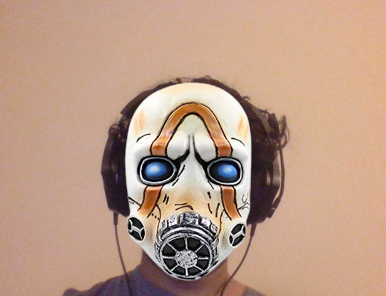

# Psycho Mask - Snapchat Filter
Psychos are a common enemy in the Borderlands universe.
They are known for their iconic mask, that features a 
filter, and bright orange designs

This is a  real-time filter that adds the Psycho mask 
filter to faces on a live feed using facial detection.
## Sample



## Getting Started

* Clone this repository.
```bash
  git clone https://github.com/akshitagupta15june/Face-X.git
```
* Navigate to the required directory.
```bash
  cd Snapchat_Filters\Borderlands Psycho Mask Filter
```
* Install the Python dependencies.

```bash
  pip install -r requirements.txt
```
* Run the script.
```bash
  python filter.py
```

Note: Press 'q' to quit the filter
## Author

[Abir-Thakur](https://github.com/Inferno2211)

