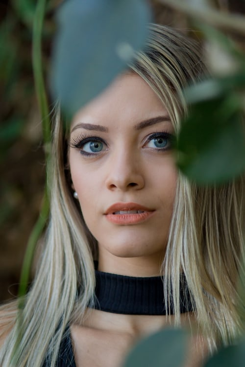

# Applying "Butterfly Glass Filter" on an image.

Converting an image into a Butterfly Glass filtered image using Cv2 and Matplotlib library in python.

## Steps:
* Firstly imported the Cv2 and Matplotlib library 
* Give the image path as input

## Methods Used
* Used a python fuction which use cv2 to fix the glass placing on the image
* And applying it on the given image
* Finally converted the image into Butterfly Glass filter image

## Original Image

## Butterfly Glass Filtered Image

