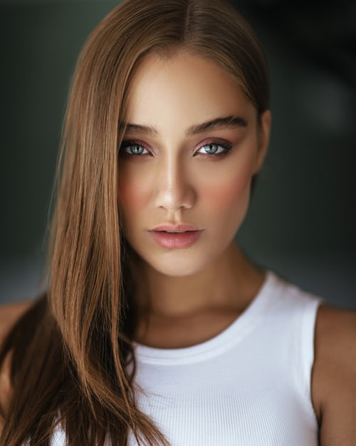

# Applying "Confused Face Filter" on an image.

Converting an image into a Confused Face filtered image using Cv2 and Matplotlib library in python.

## Steps:
* Firstly imported the Cv2 and Matplotlib library 
* Give the image path as input

## Methods Used
* Used a python fuction which use cv2 to fix the eyes placing on the image
* Used a python fuction which use cv2 to fix the mouth placing on the image
* And applying all on the given image
* Finally converted the image into Confused Face filter image

## Original Image

## Confused Face Filtered Image

