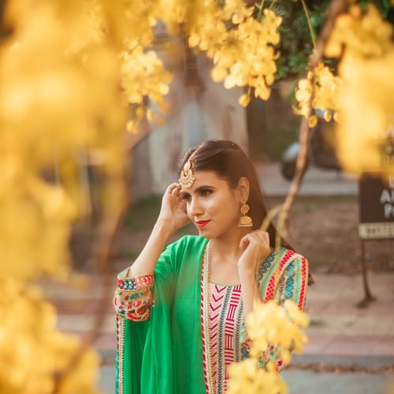

# Applying "Makar Sankranti Festival Filter" on an image.

Converting an image into a Makar Sankranti festival filtered image using Image from PIP library in python.

## Steps:
* Firstly imported the PIP library 
* Give the image path as input

## Methods Used
* Used the given image as backgroung image
* Used the given frame image as front image
* Using PIP library, pasted the given frame image on the input background image 
* Finally converted the image into Makar Sankranti festival filter image

## Original Image

## Makar Sankranti Festival Filtered Image

