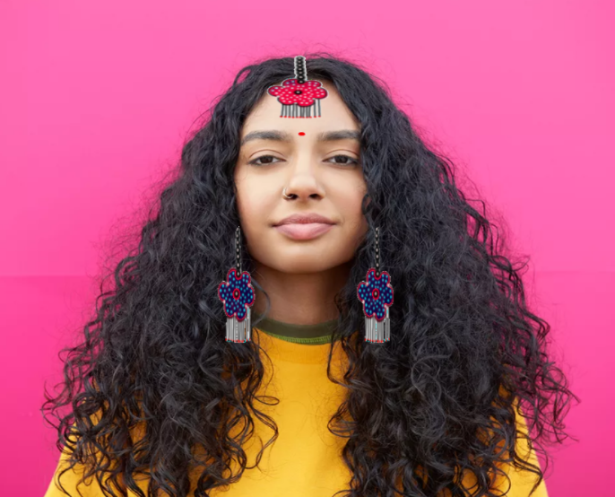

# Applying "Jewellery Filter" on an image.

Converting an image into a Jewellery filtered image using Cv2 and Matplotlib library in python.

## Steps:
* Firstly imported the Cv2 and Matplotlib library 
* Give the image path as input

## Methods Used
* Used a python fuction which use cv2 to fix the fore head jewellery placing on the image
* Used a python fuction which use cv2 to fix the earing placing on the image
* And applying both on the given image
* Finally converted the image into jewellery festival filter image

## Original Image

## Jewellery Filtered Image

