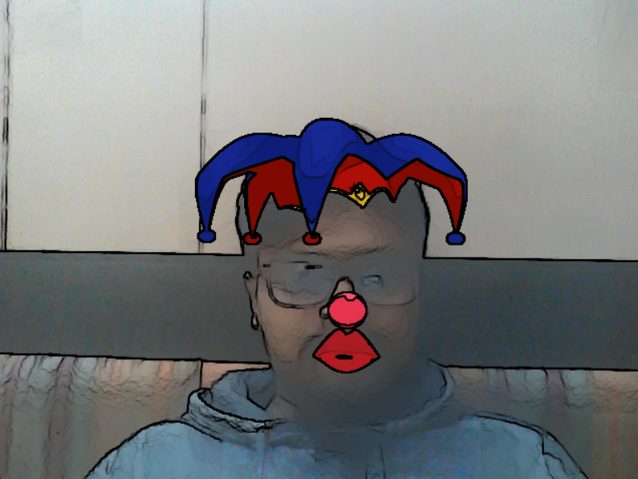

# Cool Glass Filter
## Quick Start
- Clone this repository
` git clone https://github.com/akshitagupta15june/Face-X.git`
- Change Directory
` cd Snapchat_Filters` ,then, `Joker with Cartoon Effect`
- Download shape_predictor_68_face_landmarks.dat file in Glasses on face folder.
- Run code file.
` python Joker.py`

# Screenshots

