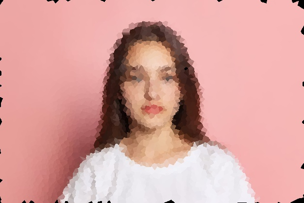

# Mosaic - Snapchat Filter
Mosaic like effect is achieved by the image being divided into
random sized polygons, and each polygon a single, solid color,
which is the average color of the pixels in that polygon

This is a  real-time filter that creates a mosaic like effect
on everything in the camera feed
## Sample



## Getting Started

* Clone this repository.
```bash
  git clone https://github.com/akshitagupta15june/Face-X.git
```
* Navigate to the required directory.
```bash
  cd Snapchat_Filters/Mosaic\ Effect\ Filter/
```
* Install the Python dependencies.

```bash
  pip install -r requirements.txt
```
* Run the script.
```bash
  python filter.py
```

Note: Press 'q' to quit the filter

## Author

[Abir-Thakur](https://github.com/Inferno2211)

