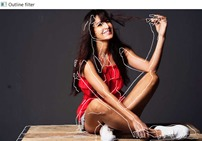
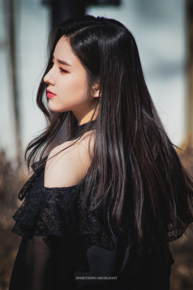
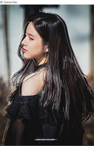

# OUTLINE FILTER

Implementing Outline filter using OpenCV

# WORKING

We obtain the input image and convert it into grayscale first. Then Produce the edges of it with canny edge detection and shift the outline from the position of real image to make it visible and pretty. Finally overlaying the outline with original image.

# USAGE

To run the program, simply type the following command :

```
pip install requirements.txt
```
```
python Outline_filter.py --image image_path/image_file_name
```

# SAMPLE 1:

Input:
 


Output:



# SAMPLE 2:

Input:



Output:




