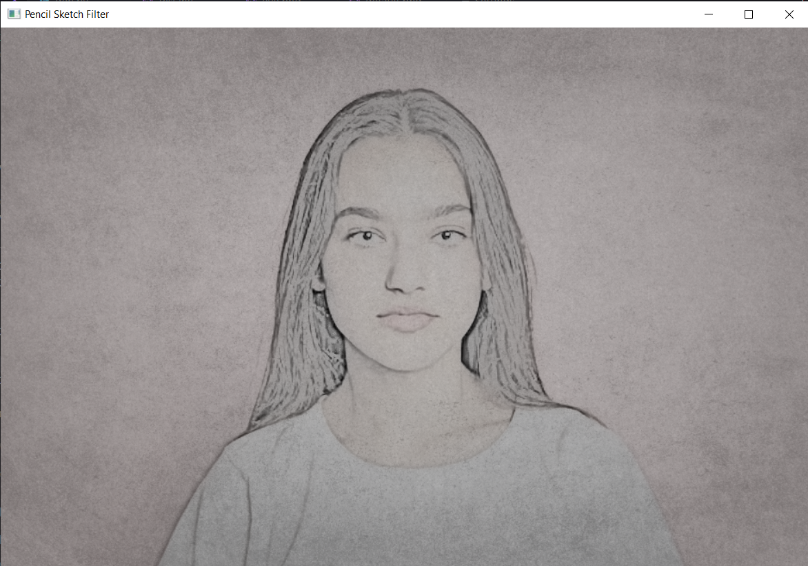

# Cartoon - Snapchat Filter
Sketch like effect is achieved by having prominent
edges and bold strokes, along with faded soft colors 
blending with the outlines

This is a  real-time filter that creates a sketch like effect
on everything in the camera feed
## Sample



## Getting Started

* Clone this repository.
```bash
  git clone https://github.com/akshitagupta15june/Face-X.git
```
* Navigate to the required directory.
```bash
  cd Snapchat_Filters/Sketch\ Filter/
```
* Install the Python dependencies.

```bash
  pip install -r requirements.txt
```
* Run the script.
```bash
  python filter.py
```

Note: Press 'q' to quit the filter

## Author

[Abir-Thakur](https://github.com/Inferno2211)

