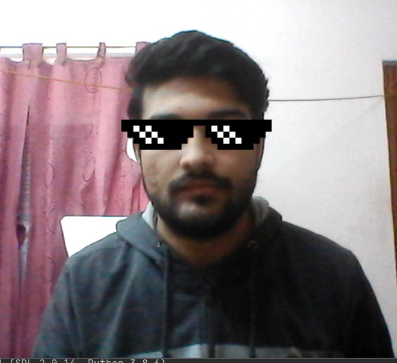

# Thug life Glass,stash and cigar filter with sound using openCV and Haarcascade:

* This project is a trial to imitate snapchat filters with sound.

### Requirements
* Python 3.7 or more 
* OpenCV - ***To install , type pip install opencv-python in the terminal.
* Download the Haarcascade file. 
* Pygame - *** To install , type pip install pygame in the terminal

### Running the program !!
* Clone this repository ` git clone https://github.com/akshitagupta15june/Face-X.git`
* Change Directory to ` Snapchat_Filters` then to `Thug_Life` (type cd Snapchat_Filters [enter] then type cd Thug_Life [enter])
* Run code using the cmd ` python thug_life.py`

### Screenshot 
