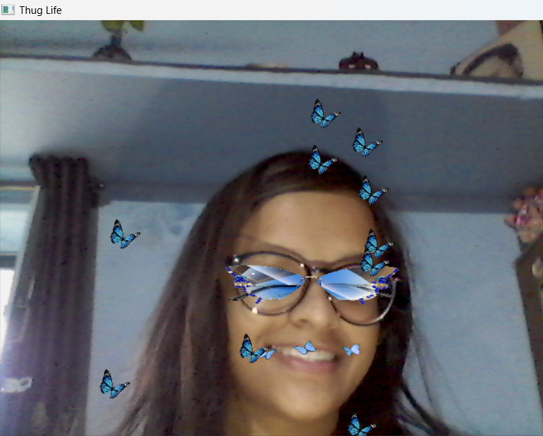

# Snapchat-Filter-using-OpenCV

## Description

This repository contains an open-source Snapchat filter created by Anamika Sadh. This filter is a butterfly filter where bytterflies move randomly in the frame. It is a cool and unique filter.

## Installation

To use this Snapchat filter, follow the steps below:

1. **Requirements**: Ensure you have the following installed on your device:
   - openCV 
   - numpy

2. **Clone the Repository**: Clone this repository to your local machine using the following command:

   ```
      $ python anamika.py
   ```

## Usage

1. **Apply the Filter**: Once the filter is imported into the Snapchat app, use it by switching to the front-facing camera and selecting the filter from the available list of lenses.

2. **Interact with the Filter**: The filter may respond to facial expressions or movements, providing an engaging and interactive experience for users.

3. **Share with Friends**: After capturing an image or video with the filter applied, users can share it with their friends on Snapchat or other social media platforms.

## Screenshots



