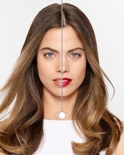
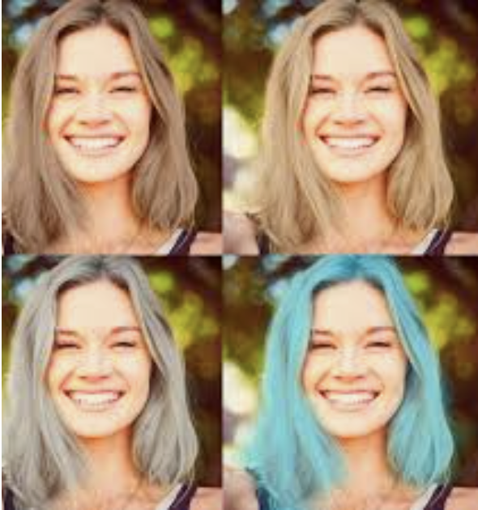
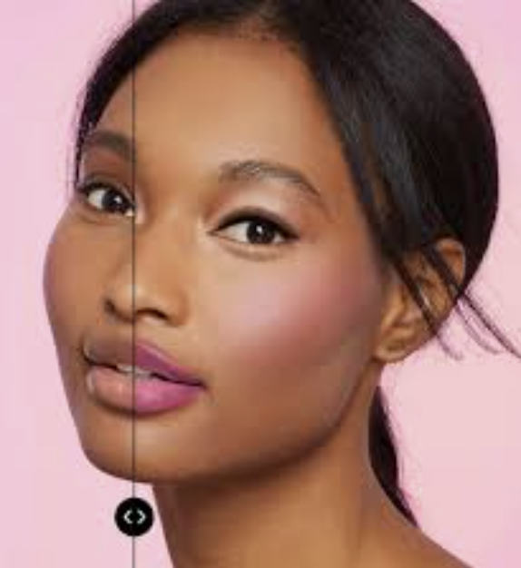

# Virtual-Makeup🧚‍♀️💅💄 👓
**Virtual Makeup**  is a smart beauty camera app feature that allows users to try on **makeup, hair colors, and accessories** via augmented reality. It works with neural networks trained to detect and modify the right part of the face e.g. lips or hair and face tracking technology to provide real-time experience. 
## Main features of virtual makeovers
You need to determine what features it should include and how you can scale them in future. Here is a shortlist of the most significant functionality considered while building a beauty AR app:
- Real-time makeover
- Face beautification
- Virtual hair color try on
- Facial feature modification e.g. slim down cheeks
- Photo / video editing 
- Face filters and AR effects
- Beauty community
- Social network integration

## Quick Start
- Clone this repository
` git clone https://github.com/akshitagupta15june/Face-X.git`
- Change Directory
` cd Virtual_makeover`
- Make a folder and add your code file and a readme file with screenshots.
- Commit message
` git commit -m "Enter message"`
- Push your code
` git push`
- Make Pull request
- Wait for reviewers to review your PR

### If you want to run script for your images or want to run real-time frame.
- Save Image in folder.
- Change script and enter your image path in VideoCapture("Enter your path here").
- Run camera.py `python camera.py` for real-time frame.
- If you want to click real-time picture and run that, then run picsaver.py ` python Picsaver.py`

## Screenshots of result
Original Image:

Makeover Image:

Comparing face before and after:

