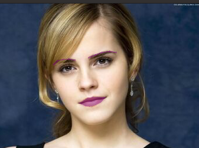

## Quick Start
- Clone this repository-
`git clone https://github.com/akshitagupta15june/Face-X.git`
- Change Directory

  `cd Virtual_makeover`
- Run file-
`python digital_makeup.py`

## Explaination
This is simply done by using PIL (Python Image Library) and face_recognition libraries. With just five steps, code works like this:

Step 1: Load the jpg file into a numpy array.

Step 2: Find all facial features in all the faces in the image.

Step 3: Load the image into a Python Image Library object so that we can draw on the top of image.

Step 4: Create a PIL drawing object to be able to draw lines later.

Step 5: The face landmark detection model returns these features: chin, left_eyebrow, right_eyebrow, nose_bridge, nose_tip, left_eye, right_eye. Thus, draw a line over the eyebrows and the lips and show the final image.

## Screenshots
Original Image:

Makeover Image:

