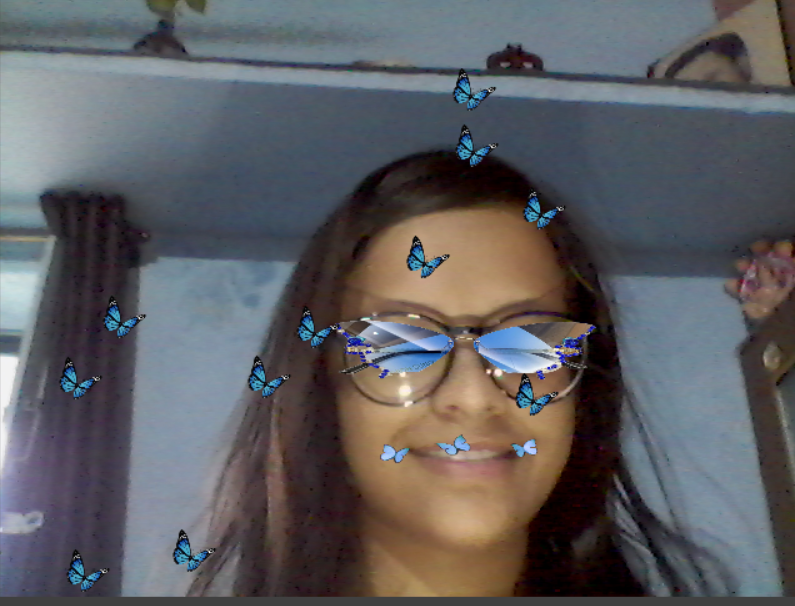
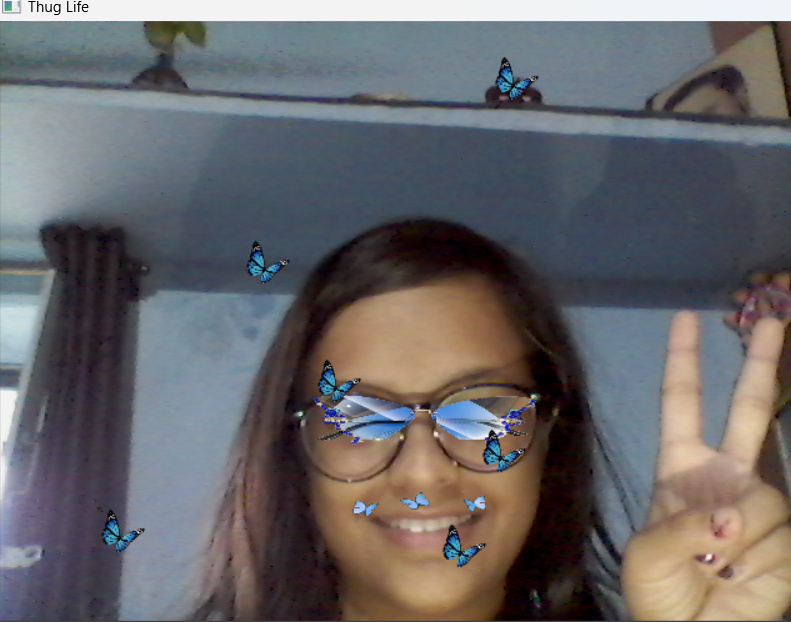

# Snapchat-Filter-using-OpenCV

## Description

This repository contains an open-source Snapchat filter. It is a beautiful butterfly filter where butterflies appear randomly in the frame. And there is also a glass which moves when we move our face.✨

## Installation

To use this filter, follow the steps below:

1. **Requirements**: Ensure you have the following installed on your device:
1. numpy 
2. openCV

2. **Clone the Repository**: Clone this repository to your local machine

3. **Run python file**: Just run the file in your sytem.

## Screenshots

