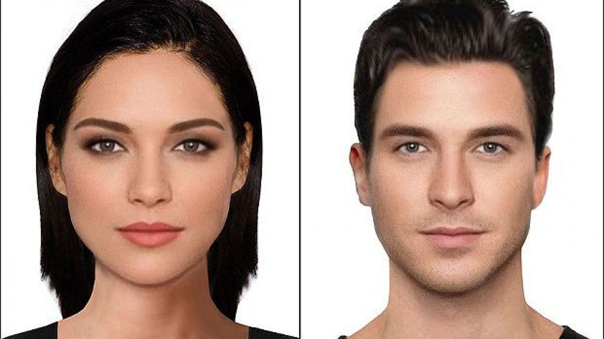

### Gender Classification API (GCA)

This is a simple `REST` and `GraphQL` api that is served to classify gender on an image given based on faces. Given an image of a human being face the server will then be able to do the binary classification if the image contains a face of a `male` or a `female`.

```shell
"No need to worry about 'Cross Origin Resource Sharing (CORS)', they are configured for you." -
```

<p align="center" with="100%">
</p>

### Getting started

To get started and start using `GCA` first you need to clone this repository by running the following command:

```shell
git clone https://github.com/akshitagupta15june/Face-X
```

You then need to navigate to the `GCA` folder by running the following command:

```shell
cd facex-library/GCA-Gender Classification API
```

### Starting the server

To run this server and make prediction on your own images follow the following steps

Create a virtual environment and activate it. You can create a `virtual` environment by running the following command

```shell
virtualenv venv
```

After creating the `virtual` environment you will need to activate it by running the following command:

```shell
.\venv\Scripts\activate
```

Run the following command to install packages

```shell
pip install -r requirements.txt
```

Navigate to the `app.py` file by running the following command:

```shell
cd app
```

To start the server you need to run

```shell
python app.py
```

The server will start on a default port of `3001` which can be configured in the `app.py` in the `Config` class which looks as follows:

```py
class AppConfig:
    PORT = 3001
    DEBUG = False
```

This server exposes two API endpoints locally for both `REST` and `GRAPHQL` which are:

1. REST - `http://localhost:3001/api/gender/classify`
2. GRAPHQL - `http://localhost:3001/graphql`

### Model Metrics

The following table shows all the metrics summary we get after training the model for few `6` epochs.

<table border="1">
    <thead>
      <tr>
        <th>model name</th>
        <th>model description</th>
        <th>test accuracy</th>
        <th>validation accuracy</th>
        <th>train accuracy</th>
         <th>test loss</th>
        <th>validation loss</th>
        <th>train loss</th>
      </tr>
    </thead>
    <tbody>
      <tr>
        <td>gender-classification</td>
        <td>classification of gender using (vgg16 and python flask)</td>
        <td>95.04%</td>
        <td>91.59%</td>
        <td>91.59%</td>
        <td>0.1273</td>
        <td>0.2593</td>
        <td>0.2593</td>
      </tr>
       </tbody>
  </table>

### Classification report

This classification report is based on the first batch of the validation dataset I used which consist of 32 images. The notebook that was used to train this can was referenced at the end of the `README`.

<table border="1">
    <thead>
      <tr>
        <th>#</th>
        <th>precision</th>
        <th>recall</th>
        <th>f1-score</th>
        <th>support</th>
      </tr>
    </thead>
    <tbody>
      <tr>
        <td>accuracy</td>
        <td></td>
        <td></td>
        <td>100%</td>
        <td>512</td>
      </tr>
      <tr>
        <td>macro avg</td>
        <td>100%</td>
        <td>100%</td>
        <td>100%</td>
        <td>512</td>
      </tr>
      <tr>
        <td>weighted avg</td>
        <td>100%</td>
        <td>100%</td>
        <td>100%</td>
        <td>512</td>
      </tr>
    </tbody>
  </table>

### Confusion matrix

The following image represents a confusion matrix for the first batch in the validation set which contains `32` images:

<p align="center" with="100%">
</p>

### GENDER CLASSIFICATION

In this section we are going to show how to use the `GCA` in classifying gender based on image of `faces` for both `REST` and `GraphQL` api using different `API` clients.

### Rest

If you hit the server at `http://localhost:3001/api/gender/classify` you will be able to get the following expected response that is if the request method is `POST` and you provide the file expected by the server.

### Expected Response

The expected response at `http://localhost:3001/api/gender/classify` with a file `image` of the right format will yield the following `json` response to the client.

```json
{
  "ok": true,
  "prediction": {
    "predictions": [
      {
        "className": "female",
        "label": 0,
        "probability": 1.0
      },
      {
        "className": "male",
        "label": 1,
        "probability": 0.0
      }
    ],
    "topPrediction": {
      "className": "female",
      "label": 0,
      "probability": 1.0
    }
  }
}
```

### Using `cURL`

Make sure that you have the image named `female.jpg` in the current folder that you are running your `cmd` otherwise you have to provide an absolute or relative path to the image. To get the same response open a new `terminal` and navigate to `images` folder in this `repository` there are example images that are in there, so for this illustration i'm using those images as examples.

> To make a `cURL` `POST` request at `http://localhost:3001/api/gender/classify` with the file `female.jpg` we run the following command.

```shell
cURL -X POST -F image=@female.jpg http://127.0.0.1:3001/api/gender/classify
```

### Using Postman client

To make this request with postman we do it as follows:

1. Change the request method to `POST` at `http://127.0.0.1:3001/api/gender/classify`
2. Click on `form-data`
3. Select type to be `file` on the `KEY` attribute
4. For the `KEY` type `image` and select the image you want to predict under `value`
5. Click send

If everything went well you will get the following response depending on the face you have selected:

```json
{
  "ok": true,
  "prediction": {
    "predictions": [
      {
        "className": "female",
        "label": 0,
        "probability": 1.0
      },
      {
        "className": "male",
        "label": 1,
        "probability": 0.0
      }
    ],
    "topPrediction": {
      "className": "female",
      "label": 0,
      "probability": 1.0
    }
  }
}
```

### Using JavaScript `fetch` api.

1. First you need to get the input from `html`
2. Create a `formData` object
3. make a POST requests

```js
const input = document.getElementById("input").files[0];
let formData = new FormData();
formData.append("image", input);
fetch("http://127.0.0.1:3001/api/gender/classify", {
  method: "POST",
  body: formData,
})
  .then((res) => res.json())
  .then((data) => console.log(data));
```

If everything went well you will be able to get expected response.

```json
{
  "ok": true,
  "prediction": {
    "predictions": [
      {
        "className": "female",
        "label": 0,
        "probability": 1.0
      },
      {
        "className": "male",
        "label": 1,
        "probability": 0.0
      }
    ],
    "topPrediction": {
      "className": "female",
      "label": 0,
      "probability": 1.0
    }
  }
}
```

### Meta data

Meta data is nothing but the description of the project in `JSON` format and it looks as follows:

```json
{
  "description": "classifying gender based on the face of a human being, (vgg16).",
  "language": "python",
  "libraries": ["tensorflow"],
  "main": "computer vision (cv)",
  "programmer": "@crispengari"
}
```

You can get this `meta` data by sending a `GET` request to the server at `http://127.0.0.1:3001/` or `http://localhost:3001/`.

### GraphQL

`GCA` also exposes a `GraphQL` api that is available at `http://localhost:3001/graphql` or `http://127.0.0.1:3001/graphql` and have a single mutation and a single query.

#### Meta Query

You can get the meta by running a `GraphQL` query that looks as follow in the `graphql` Playground:

```shell
fragment MetaFragment on MetaResponse {
  programmer
  main
  description
  language
  libraries
}

query Meta {
  meta {
    ...MetaFragment
  }
}


```

If everything went well you get the response that looks as follows:

```json
{
  "data": {
    "meta": {
      "description": "classifying gender based on the face of a human being, (vgg16).",
      "language": "python",
      "libraries": ["tensorflow"],
      "main": "computer vision (cv)",
      "programmer": "@crispengari"
    }
  }
}
```

#### Classify Gender Mutation

A gender classification Mutation mapped with fragments looks something like as follows:

```shell
fragment ErrorFragment on Error {
  field
  message
}

fragment PredictedFragment on Predicted {
  label
  probability
  className
}
fragment PredictionFragment on Prediction {
  predictions {
    ...PredictedFragment
  }
  topPrediction {
    ...PredictedFragment
  }
}

mutation ClassifyGender($input:  GenderInput!) {
   classifyGender(input: $input) {
    ok
    error {
      ...ErrorFragment
    }
    prediction {
      ...PredictionFragment
    }
  }
}
```

It takes in `input` type which need to be send to the server together with the request that looks as follow:

```json
{

  "input": {
    "image": <ImageFile>
  }
}
```

> Note that `<ImageFile>` is the image of a human face that need to be classified. It is difficult to make this kind of request using the `GraphQL Playground` for testing but we can use clients like `cURL` or `Postman`.

#### Using `cURL`

You can use `cURL` to test the graphql API in gender classification. You can send the `cURL` request to the graphql server that looks as follows:

```shell
curl http://localhost:3001/graphql -F operations='{"query":"mutation ClassifyGender($input: GenderInput!) { classifyGender(input: $input) { ok error { field message} prediction { topPrediction{ label probability className } predictions { label probability className } } } }", "variables":{"input": { "image":null } } }' -F map='{ "0": ["variables.input.image"] }' -F 0=@male.jpg
```

> Note that i'm still running these command in the `images` directory where i have `2` images `male.jpg` and `female.jpg`. So if everything went well you will get the response that looks as follows:

```json
{
  "data": {
    "classifyGender": {
      "error": null,
      "ok": true,
      "prediction": {
        "predictions": [
          {
            "className": "female",
            "label": 0,
            "probability": 0.07999999821186066
          },
          {
            "className": "male",
            "label": 1,
            "probability": 0.9200000166893005
          }
        ],
        "topPrediction": {
          "className": "male",
          "label": 1,
          "probability": 0.9200000166893005
        }
      }
    }
  }
}
```

#### Using `Postman`

Testing this `API` using postman is somehow different. You need to follow the following steps in sending the request with to the server.

1. Change the request method to `POST` at `http://127.0.0.1:3001/graphql`
2. Under `Body` tab select `form-data`
3. On the `operation` key enter the following:

```shell
{"query":"mutation ClassifyGender($input: GenderInput!) { classifyGender(input: $input) { ok error { field message} prediction { topPrediction{ label probability className } predictions { label probability className } } } }", "variables":{"input": { "image":null } } }
```

4. On the `map` key enter the following:

```shell
{ "0": ["variables.input.image"] }
```

5. On the `0` key change the type to be `file` and select the image of a human face that you want to classify.
6. Click the `[SEND]` button then you should be able to see the response from the server

> So if everything went well you will get the response that looks as follows:

```json
{
  "data": {
    "classifyGender": {
      "error": null,
      "ok": true,
      "prediction": {
        "predictions": [
          {
            "className": "female",
            "label": 0,
            "probability": 0.07999999821186066
          },
          {
            "className": "male",
            "label": 1,
            "probability": 0.9200000166893005
          }
        ],
        "topPrediction": {
          "className": "male",
          "label": 1,
          "probability": 0.9200000166893005
        }
      }
    }
  }
}
```

### Why GraphQL?

I added the graphql api endpoint so that we can resolve problem of `over-fetching` and `under-fetching` that `REST` fails to solve.

### Notebooks

The `.ipynb` notebook that I used for training the model and saving an `.h5` can be found here:

1. [Model Training And Saving](https://github.com/CrispenGari/cv-tensorflow/blob/main/01_Classification/05_Gender_VGG16/01_Gender_Classification_VGG16.ipynb)
